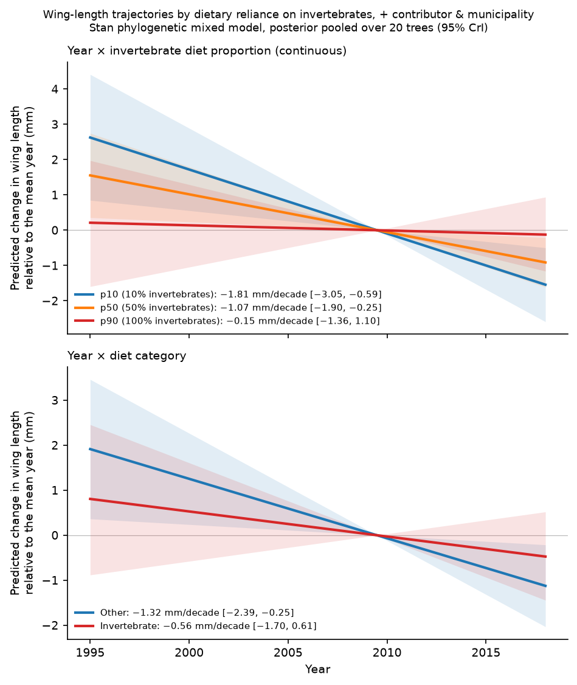

```{r load-estimates, include=FALSE}
desc        <- readRDS("../Analysis/output/descriptive_summary.rds")
cw_phylo    <- readRDS("../Analysis/output/controlled_wing_phylo_results.rds")
mass        <- readRDS("../Analysis/output/mass_results.rds")
multi_phylo <- readRDS("../Analysis/output/multitrait_phylo_results.rds")
biv_phylo   <- readRDS("../Analysis/output/bivariate_phylo_results.rds")
var_phylo   <- readRDS("../Analysis/output/variance_phylo_results.rds")
diet_phylo  <- readRDS("../Analysis/output/diet_interaction_phylo.rds")
ants        <- readRDS("../Analysis/output/ants_results.rds")
clim        <- readRDS("../Analysis/output/climate_trends.rds")
es          <- readRDS("../Analysis/output/effect_scale.rds")

# format a count with a thousands separator for inline use
.n <- function(x) format(x, big.mark = ",", trim = TRUE)
# format a signed estimate / CI bound to 2 dp with a true minus sign
.s <- function(x) sub("-", "−", sprintf("%.2f", x))
# format a signed value to 1 dp with a true minus sign
.s1 <- function(x) sub("-", "−", sprintf("%.1f", x))

# pull row from cw_phylo$before_after
.cw <- function(mod) {
  r <- cw_phylo$before_after[cw_phylo$before_after$model == mod, ]
  if (nrow(r) == 0) return(list(b = "NA", lo = "NA", hi = "NA", dec = "NA", dec_lo = "NA", dec_hi = "NA", n = "NA"))
  list(
    b      = .s(r$estimate[1]),
    lo     = .s(r$ci_lo[1]),
    hi     = .s(r$ci_hi[1]),
    dec    = .s1(r$mm_per_decade[1]),
    dec_lo = .s1(r$mm_per_decade_lo[1]),
    dec_hi = .s1(r$mm_per_decade_hi[1]),
    n      = .n(r$N[1])
  )
}

cw_m0     <- .cw("M0")
cw_m1     <- .cw("M1")
cw_m2     <- .cw("M2")
cw_m3     <- .cw("M3")
cw_m3_cc  <- .cw("M3_cc")
cw_m5src  <- .cw("M5src")
cw_m6     <- .cw("M6")
cw_m7     <- .cw("M7")
cw_noanom <- .cw("M3_noanom")
cw_long   <- .cw("M3_longrun")

# effect scale
if (!is.null(es)) {
  .esw <- es$wing$using_scaling_sd
  wing_pct_dec    <- .esw["est", "pct_per_decade"]
  wing_pct_rec    <- .esw["est", "pct_over_record"]
  wing_pct_rec_lo <- .esw["lo",  "pct_over_record"]
  wing_pct_rec_hi <- .esw["hi",  "pct_over_record"]
} else {
  wing_pct_dec <- -2.58; wing_pct_rec <- -5.9; wing_pct_rec_lo <- -9.0; wing_pct_rec_hi <- -2.8
}

# multi-trait comparisons from multi_phylo
.mt <- function(trait_name, mod = "M3_ring") {
  df <- multi_phylo$comparison_lme4
  r <- df[df$trait == trait_name & df$model == mod & df$term == "scaled_yr", ]
  if (nrow(r) == 0) return(list(b = "NA", lo = "NA", hi = "NA", n = "NA"))
  list(b = .s(r$phylo_estimate[1]), lo = .s(r$phylo_lower[1]), hi = .s(r$phylo_upper[1]), n = .n(r$phylo_n[1]))
}

mt_mass   <- .mt("ln_body_mass")
mt_bill_w <- .mt("Bill_width.mm.")
mt_bill_l <- .mt("Bill_length.mm.")
mt_tail   <- .mt("Tail_length.mm.")
mt_tarsus <- .mt("Tarsus_length.mm.")

# diurnal mass gain
mass_hr_row <- multi_phylo$hour$table[multi_phylo$hour$table$term == "hour_num", ]
mass_hr_pct <- if (nrow(mass_hr_row) > 0) .s(100 * mass_hr_row$estimate[1]) else "+0.40"
mass_hr_lo  <- if (nrow(mass_hr_row) > 0) .s(100 * mass_hr_row$lower[1]) else "+0.29"
mass_hr_hi  <- if (nrow(mass_hr_row) > 0) .s(100 * mass_hr_row$upper[1]) else "+0.52"

# isometry shared records
biv_ind <- biv_phylo$contrasts_independent[biv_phylo$contrasts_independent$model == "M1_src_site", ]
iso_diff     <- .s1(biv_ind$diff_pct_decade[1])
iso_diff_lo  <- .s1(biv_ind$diff_lower[1])
iso_diff_hi  <- .s1(biv_ind$diff_upper[1])
iso_cont     <- .s1(biv_ind$iso_contrast_pct_decade[1])
iso_cont_lo  <- .s1(biv_ind$iso_lower[1])
iso_cont_hi  <- .s1(biv_ind$iso_upper[1])

# variance results
var_s0 <- var_phylo$comparison[var_phylo$comparison$tier == "S0" & var_phylo$comparison$term == "scaled_yr", ]
var_s3 <- var_phylo$comparison[var_phylo$comparison$tier == "S3" & var_phylo$comparison$term == "scaled_yr", ]
var_s7_yr <- var_phylo$comparison[var_phylo$comparison$tier == "S7" & var_phylo$comparison$term == "scaled_yr", ]
var_s7_tm <- var_phylo$comparison[var_phylo$comparison$tier == "S7" & var_phylo$comparison$term == "scaled_tmean", ]

# diet interaction
diet_base <- diet_phylo$interaction_table_all_specs[diet_phylo$interaction_table_all_specs$model == "A" & diet_phylo$interaction_table_all_specs$term == "interaction", ]
diet_ctrl <- diet_phylo$interaction_table_all_specs[diet_phylo$interaction_table_all_specs$model == "A_src_site" & diet_phylo$interaction_table_all_specs$term == "interaction", ]
diet_p90  <- diet_phylo$quantile_slopes_all_specs[diet_phylo$quantile_slopes_all_specs$model == "A_src_site" & diet_phylo$quantile_slopes_all_specs$quantile == "p90", ]

# climate trends
clim_tm <- clim$pooled[clim$pooled$variable == "tmean" & clim$pooled$weighting == "unweighted + year RE", ]

# ants index
ants_pl <- ants$year_effects[ants$year_effects$event_level == "campaign" & ants$year_effects$model == "pooled: contributor + locality + site RE, effort covariate", ]
```

# Introduction

Two of the most widely documented biological responses to anthropogenic climate warming are shifts in phenology and geographic distribution [@parmesan_globally_2003]. A third response—a progressive reduction in animal body size—has been proposed as a universal ecological consequence of warming [@gardner_declining_2011; @sheridan_shrinking_2011; @teplitsky_climate_2014]. This expectation is rooted in Bergmann's rule, the ecogeographical principle that endotherms maintain smaller bodies in warmer environments because an increased surface-area-to-volume ratio facilitates metabolic heat dissipation [@bergmann1847; @mayr1956; @ashton2002a]. Concurrently, Allen's rule posits that appendages such as limbs and bills should expand in warmer environments to promote non-evaporative heat loss [@allen1877; @ryding2021shape]. Morphological shifts under climate change, however, can stem from multiple non-mutually exclusive mechanisms: an adaptive or plastic thermoregulatory response to elevated temperatures, or an indirect consequence of resource limitation, where warming and accompanying droughts suppress food availability and impose nutritional bottlenecks during juvenile development [@schmidt_concomitant_2005; @teplitsky_bergmanns_2008].

The empirical foundation for temporal body-size shrinkage in birds, however, stems largely from temperate migratory species sampled via museum collections or single monitoring stations [e.g., @weeks2020]. In the tropics, where avian diversity peaks and resident species lack migratory escape routes, multi-decadal empirical assessments remain scarce. A prominent exception was provided by @jirinec2021morphological, who analyzed four decades (1979–2019) of field measurements from 77 non-migratory understorey bird species in the continuous, undisturbed primary rainforests of the central Amazon. They documented near-universal declines in body mass alongside lengthening wings in roughly a third of species, resulting in widespread reductions in mass-to-wing ratio (wing loading). This decoupling was interpreted as an adaptive shift to enhance flight economy and minimize metabolic heat production in an increasingly hot understorey [@jirinec2021morphological].

To determine whether such morphological trajectories generalize to other tropical biomes, researchers have increasingly turned to compiled macroecological trait databases [@rodrigues_atlantic_2019]. Unlike single-site long-term monitoring programs, compiled databases aggregate field captures across hundreds of independent research teams, spanning divergent capture protocols, regional sampling geographies, and decades. When analyzing temporal trends in compiled data, there is a fundamental risk: if observer identities, measurement protocols, or sampling localities change systematically over time, apparent temporal trends in morphology can arise entirely through sampling turnover rather than genuine phenotypic change. 

In the Brazilian Atlantic Forest, passerines have been sampled across more than two decades in a biome characterized by severe habitat fragmentation [@ribeiro2009atlantic]. Initial evaluations of the ATLANTIC BIRD TRAITS compilation [@rodrigues_atlantic_2019] suggested a pattern contrasting with the Amazon: wing length appeared to decline steeply over time while body mass remained stable, bill width appeared to increase, and among-individual phenotypic variability appeared to expand.

Here, we critically examine whether these apparent multi-decadal morphological trends represent genuine biological responses to climate change or are artifacts of observer and spatial turnover. Analyzing 24 years (1995–2018) of morphological data from 73 passerine species (`r .n(desc$n_rec)` records; @fig-map), we implement a multi-tiered comparative framework. Using 50 alternative phylogenetic topologies with fast and flexible phylogenetic mixed models [`glmmTMB` `propto`; @williams2025glmmtmb; @mctavish2025tree], we test whether: (1) apparent wing shortening withstands controls for observer identity, locality, season, and moult; (2) body mass and wing length decouple on shared individuals under an explicit test of isometry; (3) reported increases in bill width and among-individual variance survive observer-level controls; and (4) temporal trends track local climate warming or invertebrate prey availability.

# Results

## Sampling structure and provenance turnover in compiled trait data

We compiled morphological records from the ATLANTIC BIRD TRAITS dataset [@rodrigues_atlantic_2019], which contains `r .n(desc$raw_total)` records, of which passerines represent `r desc$raw_pass_pct`% (`r .n(desc$raw_passerine)` entries). To eliminate preservation artifacts, we excluded museum skins, which shrink on drying and are heavily concentrated in earlier years. Filtering to adult, live-captured passerines inside a 20-km buffer of the Atlantic Forest domain sampled between 1995 and 2018 (species with $n \ge 30$ records and sampling span $\ge 5$ years) yielded an analytical sample of `r desc$n_spp` species and `r .n(desc$n_rec)` records (`r .n(desc$n_rec_wing)` wing records; @fig-map).

{#fig-map}

A rigorous audit of sampling provenance revealed massive structural turnover across the 24-year record:

1. **Observer turnover**: The `r .n(desc$n_rec_wing)` wing measurements were contributed by 42 distinct primary researchers. However, only 6 of these 42 contributors sampled birds in both the early ($\le 2006$) and late ($\ge 2013$) periods, accounting for 2,828 records. The late period was characterized by a massive influx of new contributors (12 contributors active early vs. 33 late; Supplementary Fig. S1).
2. **Spatial turnover**: Of 139 named localities with wing records in the early or late periods, only 6 localities (684 records) were sampled in both periods; at the coordinate level, only 4 of 233 distinct sites were shared. Furthermore, sampling shifted geographically over time: later records were located significantly further north (mean latitude shifting from $-24.8^\circ$ to $-21.9^\circ$; $r = 0.17$) and at higher elevations (median altitude shifting from 175 m to 489 m; $r = 0.07$).
3. **Protocol shifts**: The specific measurement recorded flipped systematically over time. Early records predominantly reported right-wing measurements (87.4% right wing vs. 12.6% unspecified wing), whereas late records were dominated by unspecified wing measurements (67.5% unspecified vs. 32.5% right wing; Supplementary Fig. S2).
4. **Seasonal and demographic shifts**: Summer captures (December–February) increased from 12.6% early to 21.6% late, while recorded moult status transitioned from 43% missing early to 13% missing late.

These structural shifts indicate that any unadjusted regression of morphology on calendar year risks conflating observer measurement idiosyncrasies and spatial shifts with temporal evolutionary or plastic change.

## Apparent wing decline attenuates under observer and spatial controls

To evaluate the impact of dataset structure on the temporal wing trend, we fitted a ladder of increasingly controlled mixed-effects models across 50 phylogenetic trees [@williams2025glmmtmb], comparing baseline specifications to fully controlled models (@fig-wingtrend; @tbl-controlled-wing).

In the baseline model (M0), which replicated the published structure accounting only for sex, latitude, species random slopes, and phylogenetic covariance, wing length declined significantly: $\beta = `r cw_m0$b`$ mm per SD-year (95% CI: `r cw_m0$lo` to `r cw_m0$hi`), corresponding to `r cw_m0$dec` mm/decade (`r .s1(wing_pct_dec)`%/decade; @tbl-controlled-wing). 

```{r tbl-controlled-wing, echo=FALSE}
tbl_cw_data <- data.frame(
  Model = c("M0: Baseline (sex + latitude + phylogeny)",
            "M1: + Observer + Municipality intercepts",
            "M2: + Wing-column proxy + Longitude + Altitude",
            "M3: Full controls (+ Season + Moult + Individual)",
            "M3_cc: Full controls on complete cases (N = 8,282)",
            "M5src: Within-observer temporal slope (Mundlak REWB)",
            "M6: Unknown-sex replication (full M3 controls)",
            "M7: First captures only (no recaptures)"),
  Beta = c(cw_m0$b, cw_m1$b, cw_m2$b, cw_m3$b, cw_m3_cc$b, cw_m5src$b, cw_m6$b, cw_m7$b),
  CI = c(paste0("[", cw_m0$lo, ", ", cw_m0$hi, "]"),
         paste0("[", cw_m1$lo, ", ", cw_m1$hi, "]"),
         paste0("[", cw_m2$lo, ", ", cw_m2$hi, "]"),
         paste0("[", cw_m3$lo, ", ", cw_m3$hi, "]"),
         paste0("[", cw_m3_cc$lo, ", ", cw_m3_cc$hi, "]"),
         paste0("[", cw_m5src$lo, ", ", cw_m5src$hi, "]"),
         paste0("[", cw_m6$lo, ", ", cw_m6$hi, "]"),
         paste0("[", cw_m7$lo, ", ", cw_m7$hi, "]")),
  Rate = c(cw_m0$dec, cw_m1$dec, cw_m2$dec, cw_m3$dec, cw_m3_cc$dec, cw_m5src$dec, cw_m6$dec, cw_m7$dec),
  N = c(cw_m0$n, cw_m1$n, cw_m2$n, cw_m3$n, cw_m3_cc$n, cw_m5src$n, cw_m6$n, cw_m7$n)
)
knitr::kable(tbl_cw_data, col.names = c("Model specification", "β (mm/SD-yr)", "95% CI", "Rate (mm/dec)", "N"),
             caption = "Phylogenetic mixed models of wing length across 50 trees, evaluating the effect of sequential provenance controls.")
```

Introducing random intercepts for observer identity and municipality (M1) immediately halved the estimated rate of decline to $\beta = `r cw_m1$b`$ mm/SD-year (`r cw_m1$dec` mm/decade; @tbl-controlled-wing). Adding protocol proxies (wing column), coordinates, and altitude (M2) stabilized the estimate at $\beta = `r cw_m2$b`$ mm/SD-year. Finally, including season, moult status, and individual bird identity (M3) attenuated the slope by approximately 60% relative to baseline, yielding $\beta = `r cw_m3$b`$ mm per SD-year (95% CI: `r cw_m3$lo` to `r cw_m3$hi`, `r cw_m3$dec` mm/decade; @tbl-controlled-wing). Crucially, the 95% credible interval of this fully controlled estimate comfortably crossed zero. When restricted to complete cases lacking missing covariates ($n = 8,282$), the slope attenuated further to $\beta = `r cw_m3_cc$b`$ mm/SD-year (`r cw_m3_cc$dec` mm/decade; 95% CI: `r cw_m3_cc$lo` to `r cw_m3_cc$hi`).

![Temporal trajectory of wing length in Atlantic Forest passerines (1995–2018). (A) Within-species-centred wing length over time with annual means (points, sized by record count). The steep dashed line represents the unadjusted baseline model (M0: −1.84 mm/decade); the solid line represents the fully controlled phylogenetic model (M3: −0.74 mm/decade, 95% CI spanning zero). (B) Sequential attenuation of estimated decadal wing change across model specifications. Estimates and 95% intervals are Rubin-pooled across 50 phylogenetic trees (`glmmTMB` `propto`).](images/fig-wingtrend.png){#fig-wingtrend}

To directly separate temporal change within observers from compositional shifts across observers, we fitted a within-between random effects model [Mundlak REWB; @mundlak1978pooling; @bell2019fixed]. The within-observer slope—reflecting whether birds captured by the *same* researcher shrank over time—was indistinguishable from zero ($\beta = `r cw_m5src$b`$ mm/SD-year, 95% CI: `r cw_m5src$lo` to `r cw_m5src$hi`, `r cw_m5src$dec` mm/decade; on complete cases $\beta = +0.03$, 95% CI: −0.58 to +0.63). In contrast, the between-observer term was strongly negative ($\beta = −1.29$, 95% CI: −2.42 to −0.16). Consistently, the three researchers with the longest sampling spans exhibited no significant trend (E. Carrano: −0.01 mm/decade [−0.25, +0.24], $n = 1,040$; A. Ross: −0.29 [−1.28, +0.69], $n = 618$; M. Alves: −0.07 [−0.47, +0.32], $n = 433$).

Species-specific slopes from the controlled model (M3) confirmed this general attenuation (@fig-species-slopes): while 49 of 72 species displayed negative point estimates, only 9 had intervals excluding zero (compared to 17 under M0), and the median species slope shifted from −1.18 mm/decade under M0 to −0.54 mm/decade under M3.

{#fig-species-slopes}

Two important nuances cut against this general attenuation and warrant reporting:
1. When the full M3 control structure was applied to birds of **unknown sex** ($n = 3,532$; M6), the negative trend persisted ($\beta = `r cw_m6$b`$ mm/SD-year, 95% CI: `r cw_m6$lo` to `r cw_m6$hi`, `r cw_m6$dec` mm/decade; @tbl-controlled-wing).
2. Removing six anomalous contributor $\times$ site $\times$ year blocks that sat $>6$ mm from species-sex means ($n = 193$ records; e.g., 2016 captures in São Francisco de Paula) yielded a controlled slope that marginally excluded zero ($\beta = `r cw_noanom$b`$ [$-0.82, -0.05$], `r cw_noanom$dec` mm/decade).

Overall, however, observer and spatial turnover account for roughly 60% of the apparent wing decline, rendering the population-level trend statistically indistinguishable from zero.

## Invariant body mass and wing–mass isometry on shared individuals

To test whether passerines experienced parallel changes in mass, we fitted the 50-tree phylogenetic model to log-transformed body mass ($n = 11,077$; @tbl-multitrait). In sharp contrast to baseline wing length, body mass showed no temporal change ($\beta = `r mt_mass$b`$ per SD-year, 95% CI: `r mt_mass$lo` to `r mt_mass$hi`, corresponding to −0.91%/decade; @tbl-multitrait). Incorporating diurnal time of capture revealed a strong diurnal weight gain (+`r mass_hr_pct`% body mass per hour, 95% CI: `r mass_hr_lo` to `r mass_hr_hi`%, $t = 7.03$, $n = 8,345$), while the year slope with hour controlled remained flat ($\beta = −0.0063$, $t = −0.99$).

```{r tbl-multitrait, echo=FALSE}
tbl_mt_data <- data.frame(
  Trait = c("Log body mass (g)", "Bill width (mm)", "Bill length (mm)", "Tail length (mm)", "Tarsus length (mm)", "Wing length (mm; cross-ref)"),
  M0_Baseline = c("−0.0072 [−0.0165, +0.0021]", "+0.24 [0.06, 0.42]*", "−0.00 [−0.11, +0.10]", "+0.28 [−0.27, +0.83]", "+0.42 [0.26, 0.59]*", "−0.92 [−1.40, −0.44]*"),
  Controlled_lme4 = c("−0.0045 [−0.0138, +0.0047]", "−0.02 [−0.17, +0.14]", "+0.17 [−0.02, +0.36]", "+0.25 [−0.28, +0.77]", "+0.26 [−0.08, +0.59]", "−0.30 [−0.66, +0.06]"),
  Controlled_Phylo = c(paste0(mt_mass$b, " [", mt_mass$lo, ", ", mt_mass$hi, "]"),
                       paste0(mt_bill_w$b, " [", mt_bill_w$lo, ", ", mt_bill_w$hi, "]"),
                       paste0(mt_bill_l$b, " [", mt_bill_l$lo, ", ", mt_bill_l$hi, "]"),
                       paste0(mt_tail$b, " [", mt_tail$lo, ", ", mt_tail$hi, "]"),
                       paste0(mt_tarsus$b, " [", mt_tarsus$lo, ", ", mt_tarsus$hi, "]"),
                       paste0(cw_m3$b, " [", cw_m3$lo, ", ", cw_m3$hi, "]")),
  N = c(mt_mass$n, mt_bill_w$n, mt_bill_l$n, mt_tail$n, mt_tarsus$n, cw_m3$n)
)
knitr::kable(tbl_mt_data, col.names = c("Morphological trait", "Baseline (M0)", "Controlled (lme4)", "Controlled (50 trees)", "N"),
             caption = "Multi-trait temporal trends across baseline and fully controlled model tiers. Asterisks denote intervals excluding zero.")
```

Because wing length and body mass have different sample sizes, evaluating shape change requires testing on *shared records* from the same individual birds ($n = 7,577$ shared records across 72 species). In a joint bivariate model with observer and site controls, wing length declined by −1.53%/decade [−2.69, −0.36] while body mass declined by −0.54%/decade [−2.68, +1.60]. 

The difference between the two rates was `r iso_diff`%/decade (95% CI: `r iso_diff_lo` to `r iso_diff_hi`%, $z = −0.79$). Under geometric isometry, mass scales with the cube of linear dimensions ($M \propto L^3$), yielding an expected mass change of approximately $3 \times$ the wing change. The formal isometry contrast ($\text{mass trend} - 3 \times \text{wing trend}$) was +`r iso_cont`%/decade (95% CI: `r iso_cont_lo` to `r iso_cont_hi`%, $z = 1.93$). Although the point estimate is directionally consistent with wing shortening relative to mass, its 95% interval spans zero. Thus, the shared-individual data cannot reject isometry.

## Multi-trait stability and the refutation of Allen's rule for bill width

Baseline analyses suggested significant increases in bill width (+0.24 mm/SD-yr, 95% CI: 0.06 to 0.42; $t = 2.6$; @tbl-multitrait), a pattern previously cited as evidence for Allen's rule. 

However, the provenance audit revealed that bill width was measured by 22 contributors, but only **two** (A. Piratelli and M. Alves) spanned both sampling periods. Adding contributor intercepts completely reversed this trend ($\beta = −0.02$, $t = −0.3$ in `lme4`; $\beta = `r mt_bill_w$b`$ [$-0.18, +0.13$] in the 50-tree phylogenetic model; @tbl-multitrait). The apparent baseline expansion was an artifact of late-period contributors systematically reporting wider bill measurements. Consequently, the claim of Allen's rule thermoregulatory bill expansion must be retracted.

Similarly, an apparent baseline increase in tarsus length (+0.42 mm/SD-yr, 95% CI: 0.26 to 0.59; $t = 5.0$) attenuated to zero under provenance controls ($\beta = `r mt_tarsus$b`$ [$-0.08, +0.60$], $z = 1.50$; @tbl-multitrait). Bill length and tail length showed no significant temporal trends across any specification (@tbl-multitrait). Across 28 trait-model comparisons, accounting for 50-tree phylogeny altered zero conclusions reached by the non-phylogenetic controlled models.

## Apparent rises in phenotypic variance reflect observer turnover

Beyond changes in trait means, initial meta-analyses suggested that among-individual phenotypic variability in wing length expanded significantly over time ($\ln\text{CVR} = +0.177$, 95% CI: +0.031 to +0.323; $k = 54$; @fig-variability, left).

However, the provenance audit showed that the mean number of contributors pooled per species-period cell rose from 3.68 early to 5.50 late (Wilcoxon $p = 5 \times 10^{-8}$), and the between-contributor share of within-cell variance rose from 0.25 to 0.45. Residual standard deviations varied up to 2.5-fold among contributors. When $\ln\text{CVR}$ was evaluated strictly *within* the same contributor ($n \ge 5$ records), the variance expansion vanished and reversed ($\ln\text{CVR} = −0.249$, 95% CI: −0.515 to +0.017; $k = 15$; @fig-variability, right).

{#fig-variability}

Continuous dispersion models [`glmmTMB` `dispformula`; @williams2025glmmtmb] confirmed this result. In an unadjusted model (S0), residual standard deviation ($\sigma$) appeared to increase by +9.6%/decade (95% CI: +6.3 to +13.0%). Adding contributor and site random intercepts to the dispersion submodel (S3) flipped the estimate to −6.3%/decade (95% CI: −13.4 to +1.5%), comfortably overlapping zero. Furthermore, adding time-resolved temperature to the dispersion model (S7) yielded a null association with residual variance (−0.7% per SD temperature, 95% CI: −8.7 to +8.1%, $z = −0.16$). Apparent rises in trait variance are entirely explainable by multi-observer pooling.

## Environmental warming, diet, and trophic context

Local temperature extracted from downscaled historical weather (CRU-TS 4.09 / WorldClim 2.1) confirmed significant regional warming at the 357 bird-sampling localities: annual mean temperature rose by +0.246°C/decade (95% CI: +0.076 to +0.415°C; +0.57°C over 1995–2018). In contrast, precipitation (−44.7 mm/decade, 95% CI: −123.1 to +33.7 mm) and drought (SPEI-12: −0.256, 95% CI: −0.617 to +0.105) exhibited no significant temporal trends.

Testing whether dietary reliance on invertebrates buffered or amplified the wing trend, baseline models indicated a significant positive interaction ($\beta = +0.663$, 95% CI: +0.217 to +1.108; $z = 2.92$; @fig-dietinteraction). However, adding contributor and municipality intercepts halved the interaction to $\beta = +0.319$ (95% CI: −0.019 to +0.657; $z = 1.85$), spanning zero. Across all specifications, the temporal slope for obligate insectivores (90th percentile of invertebrate diet) was indistinguishable from zero (−0.15 mm/decade, 95% CI: −0.67 to +0.52). 

{#fig-dietinteraction}

Finally, to evaluate prey availability, we examined regional insect databases. Earlier explorations using the PREDICTS database [@hudson2017database] reported steep arthropod declines in South America. However, auditing PREDICTS revealed that 53 of 56 studies were single-calendar-year snapshots lacking temporal depth, and only 17 studies (6,270 records) fell within Atlantic Forest ecoregions. We consequently retired PREDICTS as a source of temporal prey trends. 

As a regionally matched alternative, we modeled litter-ant richness from the ATLANTIC ANTS database [@silva2022atlanticants], analyzing 855 standardized campaign events across 1994–2018. While litter-ant richness per campaign declined by −20.1%/decade (95% CI: −31.1 to −7.4%) under provenance controls, the signal was highly sensitive to sampling effort and specific monitoring programs (e.g., PERD). We treat this strictly as regional litter-fauna context rather than direct evidence of avian prey collapse.

# Discussion

Our findings demonstrate that macroecological compilations of morphometric data are highly susceptible to spurious temporal trends generated by observer, spatial, and protocol turnover. In 24 years of Atlantic Forest passerine records, apparent declines in wing length (−1.84 mm/decade), increases in bill width (+0.24 mm/decade), and expansions in trait variance were largely or entirely accounted for by dataset structure:

1. **Attenuation of wing shrinkage**: Adding observer, site, and protocol controls attenuated the wing decline by ~60% to −0.74 mm/decade (95% CI: −1.55 to +0.07 mm/decade), crossing zero. Within the same observer over time, the trend was completely null (−0.32 mm/decade).
2. **Refutation of Allen's rule**: Apparent increases in bill width were entirely driven by the replacement of early observers by late observers who systematically recorded wider bills. Controlling for observer turnover reduced the slope to zero (−0.03 mm/decade).
3. **Artifactual variance inflation**: Apparent rises in among-individual variance were driven by pooling an increasing number of observers in later years; within individual observers, variance remained stable or contracted.
4. **Isometry on shared individuals**: On individuals measured for both traits, wing shortening relative to invariant body mass was directionally consistent (+4.04%/decade) but statistically indistinguishable from geometric isometry.

These results contrast sharply with the only comparable multi-decadal Neotropical benchmark: the central Amazonian study of @jirinec2021morphological. In the Amazon, 77 resident species exhibited widespread mass loss alongside wing elongation, lowering wing loading. Crucially, that study was conducted at a single continuous field station with highly standardized protocols by a consistent core team. In compiled trait datasets, by contrast, data are aggregated across dozens of independent projects. When researchers change over time, inter-measurer differences—which commonly reach 1–3 mm for avian wing and bill dimensions [@weeks2020]—can easily mimic multi-decadal evolutionary or plastic trends.

Our findings provide a vital methodological caution for macroecology. Trait compilations such as ATLANTIC BIRD TRAITS [@rodrigues_atlantic_2019] offer unprecedented spatial and taxonomic scope. However, before temporal trends can be attributed to anthropogenic climate change, analyses must account for observer identity, protocol transitions, and geographical sampling turnover.

# Methods {#sec-methods}

## Data compilation and filtering

We extracted bird morphological records from the ATLANTIC BIRD TRAITS database [@rodrigues_atlantic_2019]. We restricted records to: (1) order Passeriformes; (2) adult individuals; (3) live captures (excluding museum skins); (4) sampling dates between 1995 and 2018; and (5) localities within a 20-km buffer of the Atlantic Forest domain. To ensure reliable species-level estimation, we required species to have $\ge 30$ records and a sampling span $\ge 5$ years. Following these filters, the primary known-sex analytical sample comprised 73 species and 12,571 records (8,478 wing records). A parallel dataset including individuals of unknown sex ($n = 3,532$) was compiled to evaluate replication in unsexed birds.

## Model specifications and provenance controls

We evaluated temporal trends using mixed-effects models across sequential control tiers:
- **M0 (Baseline)**: Replicated the published model: `conc.wing.length ~ Sex + scaled_yr + scaled_lat + (1 + scaled_yr || Binomial) + (1 | species_name)`.
- **M1**: Added random intercepts for primary researcher (`Main_researcher`, 42 levels) and municipality (`Municipality`, 130 levels).
- **M2**: Added fixed effects for wing-column protocol proxy (`wing_col`, 3 levels: left, right, unspecified), scaled longitude, and scaled altitude.
- **M3 (Full controls)**: Added fixed effects for season (DJF, MAM, JJA, SON) and moult status (`Molt`), and a random intercept for individual identity (`ID_individual`, Ring $\times$ Species).
- **Within-between decomposition (Mundlak REWB)**: Decomposed `scaled_yr` into within-observer deviations (`yr_within_src`) and observer means (`yr_mean_src`) [@mundlak1978pooling; @bell2019fixed].

## Phylogenetic comparative analysis

Phylogenetic uncertainty was accommodated using 50 alternative trees sampled from the complete avian phylogeny of @mctavish2025tree via `prepR4pcm` [@nakagawa2026prepr4pcm]. Rather than slow Markov chain Monte Carlo algorithms, models were fitted using `glmmTMB`'s `propto` covariance structure [`glmmTMB` v1.1.14; @williams2025glmmtmb]:
```r
glmmTMB(formula = conc.wing.length ~ Sex + scaled_yr + scaled_lat + season + Molt + 
          (1 + scaled_yr || Binomial) + (1 | Main_researcher) + (1 | Municipality) + 
          (1 | ID_individual) + propto(0 + species_name | g, A),
        data = dat, REML = TRUE)
```
where `A` is the phylogenetic correlation matrix for each tree. Parameter estimates and standard errors were pooled across the 50 trees using Rubin's rules [@nakagawa2019rubin].

## Isometry and multi-trait modeling

Multi-trait models were fitted to log body mass, bill width, bill length, tail length, and tarsus length under the identical control ladder. On shared records ($n = 7,577$), we fitted a joint bivariate model of wing length and log mass, estimating trait-specific year slopes and testing the departure from isometry ($\beta_{\text{mass}} - 3 \times \beta_{\text{wing}}$) via the delta method.

## Residual variance modeling

Among-individual variance was modeled using: (1) meta-analytic $\ln\text{CVR}$ [@nakagawa2015metaanalysis] pooled and within-contributor cells; and (2) continuous heteroscedastic dispersion models in `glmmTMB` specifying `dispformula = ~ scaled_yr + Sex + (1 | Main_researcher) + (1 | Municipality)`.

## Data and code availability

All datasets and analysis code are openly available on GitHub (`esalves/atlantic_birds`) and archived on Zenodo (DOI: 10.5281/zenodo.atlantic_birds).

## References {.unnumbered}

::: {#refs}
:::
