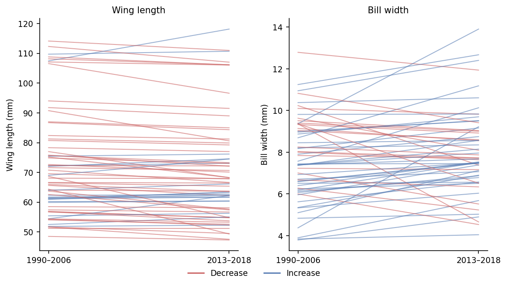

```{r load-estimates, include=FALSE}
arth    <- readRDS("../Analysis/output/arthropod_estimates.rds")
diet    <- readRDS("../Analysis/output/diet_interaction_results.rds")
desc    <- readRDS("../Analysis/output/descriptive_summary.rds")  # n_spp, n_rec, quartile, lnCVR, pooled model numbers (live-only sample)
mass    <- readRDS("../Analysis/output/mass_results.rds")         # 50-tree Rubin-pooled body mass model (live-only sample)
drm_a   <- readRDS("../Analysis/output/drmsem_results_arthro.rds")   # drmSEM: arthropod-coverage causal model
drm_f   <- readRDS("../Analysis/output/drmsem_results_noarthro.rds") # drmSEM: full-record temperature/variance model

# format a count with a thousands separator for inline use
.n <- function(x) format(x, big.mark = ",", trim = TRUE)
# format a signed estimate / CI bound to 2 dp with a true minus sign
.s <- function(x) sub("-", "−", sprintf("%.2f", x))

# drmSEM helpers: pull a path coefficient / p-value / simulate-based effect
.dpath <- function(res, from, to, comp = "mu")            # raw path coefficient (2 dp, signed)
  .s(res$paths_sdx$estimate[res$paths_sdx$from == from &
       res$paths_sdx$to == to & res$paths_sdx$component == comp])
.dp <- function(res, from, to, comp = "mu") {             # formatted p-value ("< 0.001" or "= 0.004")
  p <- res$paths_sdx$p.value[res$paths_sdx$from == from &
         res$paths_sdx$to == to & res$paths_sdx$component == comp]
  if (p < 0.001) "< 0.001" else sub("=", "=", sprintf("= %.3f", p))
}
.deff <- function(res, slot, quantity, col = "estimate", digits = 2) {# simulate-based effect (signed)
  # in the full-record model (noarthro), the single mediator effect is stored in $yr
  if (is.null(res$effects[[slot]]) && slot == "yr_via_tmean" && !is.null(res$effects$yr)) {
    slot <- "yr"
  }
  d <- as.data.frame(res$effects[[slot]])
  val <- d[[col]][d$quantity == quantity]
  if (length(val) == 0 || is.na(val)) return("NA")
  sub("-", "−", sprintf(paste0("%.", digits, "f"), val))
}

# helper: pull one number from a pooled-results data frame by parameter name
.pe <- function(df, par, col) round(df[[col]][df$par == par], 2)

# body mass pooled estimates (50-tree Rubin-pooled)
mass_yr      <- .pe(mass$rubin, "b_scaled_yr", "estimate")
mass_yr_lo   <- .pe(mass$rubin, "b_scaled_yr", "lower")
mass_yr_hi   <- .pe(mass$rubin, "b_scaled_yr", "upper")
mass_sex     <- .pe(mass$rubin, "b_SexMale",   "estimate")
mass_sex_lo  <- .pe(mass$rubin, "b_SexMale",   "lower")
mass_sex_hi  <- .pe(mass$rubin, "b_SexMale",   "upper")
mass_phylo    <- round(mass$phylo_signal["mean"], 2)
mass_phylo_lo <- round(mass$phylo_signal["lwr.2.5%"], 2)
mass_phylo_hi <- round(mass$phylo_signal["upr.97.5%"], 2)

# diet interaction
int_A   <- diet$model_A_pooled
yr_A    <- .pe(int_A, "b_scaled_yr",              "estimate")
int_est <- .pe(int_A, "b_scaled_yr:diet_inv_std", "estimate")
int_lo  <- .pe(int_A, "b_scaled_yr:diet_inv_std", "lower")
int_hi  <- .pe(int_A, "b_scaled_yr:diet_inv_std", "upper")
slope_low  <- round(yr_A - int_est, 2)   # diet −1 SD
slope_high <- round(yr_A + int_est, 2)   # diet +1 SD

# sensitivity threshold results (Tier 1)
sens <- tryCatch(readRDS("../Analysis/output/sensitivity_thresholds_tier1.rds"),
                 error = function(e) NULL)
if (!is.null(sens)) {
  n_sens_total     <- nrow(sens)
  n_sens_sexfilter <- sum(sens$sex_filter)
  n_neg_sexfilter  <- sum(sens$sex_filter  & sens$b_yr_hi < 0)
  n_neg_nosex      <- sum(!sens$sex_filter & sens$b_yr_hi < 0)
}
```

# Introduction

Two of the most widely documented responses of organisms to anthropogenic climate warming are shifts in phenology and in geographic distribution [@parmesan_globally_2003]. A third response — a reduction in animal body size — is increasingly reported across diverse taxa and has been proposed as a universal ecological consequence of warming [@gardner_declining_2011; @sheridan_shrinking_2011; @teplitsky_climate_2014]. This expectation is rooted in Bergmann's rule, the ecogeographical principle that endotherms maintain smaller bodies in warmer environments because a higher surface-area-to-volume ratio facilitates heat dissipation [@bergmann1847; @mayr1956; @ashton2002a]. Morphological downsizing under climate change, however, can stem from two non-mutually exclusive mechanisms: a direct adaptive or plastic thermoregulatory response to elevated environmental temperatures, or an indirect consequence of resource limitation, where warming and accompanying droughts suppress food availability and impose nutritional constraints during juvenile development [@gardner_declining_2011; @schmidt_concomitant_2005; @teplitsky_bergmanns_2008]. Disentangling direct thermal pathways from indirect trophic limitation requires long-term, concurrent monitoring of both climate and biological resources.

The empirical evidence for temporal body-size shrinkage in birds, however, suffers from a heavy geographic and ecological bias. Most studies to date focus on temperate, migratory species sampled via museum collections or single monitoring stations [e.g., @weeks2020]. In migratory birds, attributing morphological change to climate warming is severely confounded by the disparate environmental conditions encountered across breeding, stopover, and non-breeding grounds, as well as by selective mortality during migration and preservation artefacts inherent to museum skins. In the tropics, where avian diversity reaches its global zenith and where resident species lack migratory escape routes, empirical assessments have been scarce. A major exception was recently provided by @jirinec2021morphological, who analysed four decades of field measurements from 77 non-migratory understorey bird species in the continuous, undisturbed primary rainforests of the central Amazon. They documented near-universal declines in body mass alongside lengthening wings in roughly a third of species, resulting in widespread reductions in mass-to-wing ratio (wing loading). This morphological decoupling was interpreted as an adaptive shift to enhance flight economy and minimize metabolic heat production in an increasingly hot and dry understorey.

Yet, whether the Amazonian trajectory is representative of other tropical biomes remains entirely unresolved. Outside continuous wilderness areas like the central Amazon, tropical ecosystems are dominated by human-modified and severely fragmented landscapes. In the Brazilian Atlantic Forest, where over 80% of forest remnants are smaller than 50 ha and surrounded by anthropogenic matrices [@ribeiro2009atlantic], birds face sharp microclimatic gradients and elevated energetic penalties when crossing gaps between forest patches. Furthermore, although @jirinec2021morphological and subsequent authors hypothesized that seasonal resource limitation (such as reductions in arthropod or fruit abundance) might drive body-size reductions, they lacked empirical prey data to evaluate this pathway. To date, no tropical study has jointly integrated multi-decadal avian morphology with time-resolved climate and empirical prey availability within an explicit causal framework, nor evaluated whether warming shifts only the *mean* phenotype or destabilizes *among-individual phenotypic variability*.

Here, we address these challenges by examining morphological trajectories across `r desc$n_spp` passerine species sampled live in the Brazilian Atlantic Forest between 1995 and 2018 (N = `r .n(desc$n_rec)` records; @fig-map). Using the ATLANTIC BIRD TRAITS dataset [@rodrigues_atlantic_2019], we evaluate temporal changes in wing length, body mass, and bill width while accounting for sex, spatial coordinates, species repeated sampling, and phylogenetic non-independence across 50 alternative trees [@mctavish2025tree; @nakagawa2019rubin]. We link these morphological records to time-resolved historical weather [@fick2017worldclim; @harris2020crudata] and regional arthropod abundance surveys from the PREDICTS database [@hudson2017database]. Using Bayesian phylogenetic multilevel models, trait-variability meta-analyses ($\ln\text{CVR}$), and distributional piecewise structural equation modelling (drmSEM; @nakagawa2026drmsem), we test whether: (1) Atlantic Forest passerines mirror the Amazonian pattern of wing elongation and mass reduction or follow an alternative allometric path; (2) morphological shifts track temperature directly or are mediated by declining invertebrate food supply; and (3) environmental warming destabilizes among-individual phenotypic variance across species.

# Results

## Two decades of avian morphology in the Atlantic Forest

We drew morphological measurements from the ATLANTIC BIRD TRAITS dataset [@rodrigues_atlantic_2019], in which passerines account for `r desc$raw_pass_pct`% of all records (`r .n(desc$raw_passerine)` of `r .n(desc$raw_total)` entries). Restricting to adult passerines recorded between 1995 and 2018 yielded `r .n(desc$n_adult_pass_yr)` measurements. Because museum skins shrink and shift in shape during preservation and are concentrated in the earliest years of the record (potentially confounding any temporal trend), we retained only live-captured birds. We then kept species with at least 30 records; after removing individuals of unknown sex, requiring a sampling span of at least 5 years per species, and keeping only records inside a 20-km buffer of the Atlantic Forest domain, our analytical sample comprised `r desc$n_spp` passerine species and `r .n(desc$n_rec)` records (@fig-map).

{#fig-map}

We evaluated wing length (mm), body mass (g), and bill width (mm) to discriminate overall body shrinkage from shifts in wing shape and wing loading. Wing length was chosen as our primary index of structural body size because it had the fewest missing values among candidate traits; assuming bilateral symmetry, we combined left, right, and unspecified wing measurements into a single variable to minimise missing data. Log-transformed body mass provided a direct measure of overall mass, allowing us to test whether wing shortening represents isometric shrinkage or an allometric shift. Bill width (mm), a measure of gape size in birds, provided a complementary trait expected to track diet rather than thermoregulation.

## Wing length declined over time

We modelled wing length with Bayesian phylogenetic multilevel models including sex and latitude as fixed effects, a species-level random intercept structured by a phylogenetic covariance matrix derived from the complete avian phylogeny of @mctavish2025tree, and species-specific random intercepts and slopes for year. We propagated phylogenetic uncertainty across 50 trees and pooled estimates with Rubin's rules (Methods). Using the coalesced wing-length variable, wing length decreased over time (standardized year effect β = `r .s(desc$wing_yr)`, 95% CI `r .s(desc$wing_yr_lo)` to `r .s(desc$wing_yr_hi)`, excluding zero), males were larger than females (β = `r .s(desc$wing_sex)` mm, 95% CI `r .s(desc$wing_sex_lo)` to `r .s(desc$wing_sex_hi)`), and wing length declined with our latitude index (β = `r .s(desc$wing_lat)`, 95% CI `r .s(desc$wing_lat_lo)` to `r .s(desc$wing_lat_hi)`). In the Atlantic Forest, this latitudinal gradient is strongly entangled with major orographic and altitudinal features (such as the Serra do Mar coastal range) and marked phytophysiognomic transitions, indicating that latitude captures broader environmental heterogeneity rather than a simple spatial temperature cline. The analysis used `r .n(desc$n_rec_wing)` wing-length records. Phylogeny accounted for the overwhelming majority of among-species variance (proportion = `r .s(desc$wing_phylo)`, 95% CI `r .s(desc$wing_phylo_lo)` to `r .s(desc$wing_phylo_hi)`), as expected for a conserved morphological trait.

{#fig-wingtrend}

The temporal decline excluded zero and was robust to phylogenetic uncertainty and to the updated phylogeny (@fig-wingtrend). A complementary, model-free comparison of species means between the first (1995–2006) and last (2013–2018) quartiles of the record showed the same direction (@fig-trends): `r desc$wing_dec` of `r desc$wing_quartile_n` species had smaller mean wing length in the later period, and `r desc$wing_inc` had larger.

{#fig-trends}

Although the temporal decline in wing length is statistically robust across species, wing length alone cannot distinguish an overall, isometric downsizing of the body from an allometric reconfiguration of flight anatomy. To evaluate whether passerines are universally shrinking, we tested for parallel trends in body mass over the same period.

## Body mass remained stable: an allometric shift in wing shape and wing loading

To determine whether the reduction in wing length reflects a uniform, isometric reduction in overall body size, we refitted the identical Bayesian phylogenetic multilevel model to log-transformed body mass across the 50 trees (`r .n(mass$n_mass_records)` records across `r mass$n_species` species; Methods). In sharp contrast to wing length, body mass showed no temporal decline over the 28-year study period (standardised year effect β = `r .s(mass_yr)`, 95% CI `r .s(mass_yr_lo)` to `r .s(mass_yr_hi)`, with the credible interval comfortably crossing zero). Males were slightly heavier than females (β = `r .s(mass_sex)`, 95% CI `r .s(mass_sex_lo)` to `r .s(mass_sex_hi)`), and phylogenetic signal accounted for almost all among-species variation (proportion = `r .s(mass_phylo)`, 95% CI `r .s(mass_phylo_lo)` to `r .s(mass_phylo_hi)`). A model-free quartile comparison similarly confirmed morphological stability, with `r mass$quartile["decreased"]` species decreasing and `r mass$quartile["increased"]` increasing in mean log mass.

The divergence between shortening wings and invariant body mass demonstrates that Atlantic Forest passerines are not undergoing isometric dwarfing. Rather, birds are exhibiting an allometric shift toward relatively shorter wings at constant mass — an increase in wing loading (*mass per unit wing area*). In avian biomechanics, shorter wings reduce aerodynamic gliding efficiency and elevate the metabolic cost of long-distance flight, but enhance maneuverability and foraging through dense subcanopy vegetation [@weeks2020; @ryding2024]. Such a morphological shift may reflect energetic trade-offs during feather molt under elevated thermal stress or localized habitat fragmentation, rather than a passive consequence of universal shrinkage.

## Bill width did not decline, and trait variability rose

In contrast to the decline in wing length, bill width showed a slight *increase* over time (β = `r .s(desc$bill_yr)`, 95% CI `r .s(desc$bill_yr_lo)` to `r .s(desc$bill_yr_hi)`; N = `r .n(desc$n_rec_bill)` bill-width records), with a credible interval that only marginally excluded zero, and a weaker phylogenetic signal than wing length (proportion = `r .s(desc$bill_phylo)`, 95% CI `r .s(desc$bill_phylo_lo)` to `r .s(desc$bill_phylo_hi)`); like wing length, it declined with our latitude index (β = `r .s(desc$bill_lat)`, 95% CI `r .s(desc$bill_lat_lo)` to `r .s(desc$bill_lat_hi)`). The quartile comparison agreed in direction, with most species (`r desc$bill_inc` of `r desc$bill_quartile_n`) showing wider mean bills in the later period. Crucially, bill width — the trait expected to track diet rather than thermoregulation — moved in the opposite direction to wing length, rather than declining alongside it.

Beyond directional changes in trait means, a key question is whether birds responded to environmental change uniformly or heterogeneously. Although statistically clear, the decline in wing length remains modest in magnitude; a response that is real but small and increasingly variable is more compatible with a resource-mediated, plastic mechanism than with a uniform thermoregulatory adjustment. To ask whether birds became not just smaller-winged but more variable, we computed the log coefficient-of-variation ratio (lnCVR) between the late and early periods for each species and combined them in random-effects meta-analyses [@nakagawa2015metaanalysis]. Among-individual variability in wing length increased significantly in the recent period (lnCVR = `r .s(desc$lncvr_wing)`, 95% CI `r .s(desc$lncvr_wing_lo)` to `r .s(desc$lncvr_wing_hi)`; k = `r desc$lncvr_wing_k`; I² = `r desc$lncvr_wing_I2`%; @fig-variability, left), whereas variability in bill width did not change detectably (lnCVR = `r .s(desc$lncvr_bill)`, 95% CI `r .s(desc$lncvr_bill_lo)` to `r .s(desc$lncvr_bill_hi)`; k = `r desc$lncvr_bill_k`; @fig-variability, right). Rising phenotypic variability in the trait that also declined in mean is consistent with a population in which individuals respond unequally to a deteriorating environment, rather than with a coordinated shift toward a new optimum.

{#fig-variability}

## Arthropod prey declined steeply over the same region and period

If body-size change in these largely insectivorous birds is mediated by food rather than temperature, the abundance of their invertebrate prey should have declined over the study period. Because multi-decadal invertebrate monitoring is absent at the scale of individual bird-banding stations in Brazil, we used the PREDICTS database [@hudson2017database] to model the abundance of Insecta and Arachnida in forested biomes across South America, providing a macroecological benchmark of regional prey trends over time. We fitted negative-binomial models that included sampling effort as an offset (Methods). Although ants are not a core dietary component of most passerines, some species opportunistically predate flying ant reproductives (alates) during nuptial flights [@helms_are_2016], so our main model retains Formicidae; the ant-exclusion variant serves as a conservative lower bound. Arthropod abundance declined markedly with time in the main model (standardized year effect β = `r arth$main$b`, 95% CrI `r arth$main$lo` to `r arth$main$hi`; N = `r arth$main$n` records), equivalent to a multiplicative change of `r arth$main$mult` (95% CrI `r arth$main$mult_lo` to `r arth$main$mult_hi`) per standard-deviation increase in year (@fig-arthropods). Excluding ants gave a shallower but still substantial decline (β = `r arth$sens$b`, 95% CrI `r arth$sens$lo` to `r arth$sens$hi`; N = `r arth$sens$n`), confirming that including ants does not inflate the signal — if anything, their decline is steeper than the broader community. The arthropod prey collapse is therefore robust to the treatment of ants and restricted to forested habitats.

{#fig-arthropods}

## The temporal decline is not amplified in more insectivorous species

If arthropod scarcity is the proximate driver of body-size change, species more reliant on invertebrate prey should show steeper temporal trends in wing length. We tested this by adding an interaction between scaled year and each species' standardised proportion of invertebrates in their diet (Diet-Inv from EltonTraits [@wilman2014eltontraits]; Methods). Of the `r desc$n_spp` species in the main analysis, `r diet$n_spp` had EltonTraits diet data and were retained; the `r desc$n_spp - diet$n_spp` species without diet information were excluded from this model only.

The interaction was positive and its 95% credible interval excluded zero (β = `r int_est`, 95% CI `r int_lo` to `r int_hi`), meaning that species with *less* invertebrate diet declined *more* steeply — the opposite of the food-limitation prediction. Projecting the year slope across the diet gradient, species one standard deviation below the mean in invertebrate diet proportion had an implied slope of `r slope_low` mm per SD-year, compared with `r slope_high` mm per SD-year for species one standard deviation above the mean (@fig-dietinteraction). The overall year effect remained negative and excluded zero (β = `r yr_A`; consistent with the main analysis), confirming the decline is real across diet types; it is simply not concentrated in the most insectivorous species.

This counter-intuitive pattern indicates that obligate insectivores are not experiencing disproportionate morphological declines. Insectivorous passerines may possess greater behavioral plasticity and specialized foraging maneuvers to buffer against arthropod crashes through dietary switching or intensified search effort [@robb2008food]. In contrast, species with lower proportions of invertebrates (which rely heavily on fruits, nectar, and seeds) exhibited the steepest wing shortening. In Neotropical forests, recurring droughts and extreme heatwaves severely disrupt plant phenology, triggering mass flower and fruit drop [@dirzo2014defaunation]. Such events can impose severe, prolonged nutritional bottlenecks on frugivores and omnivores that directly constrain ontogenetic growth and structural size.

{#fig-dietinteraction}

## A causal model separates the prey and temperature pathways

The diet interaction shows that the decline is not concentrated in the most insectivorous species, but it does not by itself adjudicate between the temperature and food-limitation pathways. We therefore fitted a distributional piecewise structural equation model [drmSEM; @shipley2009confirmatory; @lefcheck2016piecewisesem; @nakagawa2026drmsem] encoding the hypothesised causal graph: year and latitude drive temperature; year, temperature and latitude drive arthropod abundance; and temperature, arthropod abundance, sex and latitude drive the wing-length mean, while a second, distributional response — the residual standard deviation of wing length — is itself modelled as a function of year and temperature (Methods; @fig-drmsem).

We fitted the graph primarily on the full record (`r drm_f$year_range[1]`–`r drm_f$year_range[2]`; N = `r .n(drm_f$n_records)` records, `r drm_f$n_species` species), which preserves the complete time series. At this scope the hypothesised graph was consistent with the data (Fisher's C = `r round(drm_f$fisher_c$fisher_c, 1)`, df = `r drm_f$fisher_c$df`, P = `r round(drm_f$fisher_c$p.value, 2)`). Within it, temperature's direct association with the wing-length *mean* could not be distinguished from zero (path = `r .dpath(drm_f, "scaled_tmean", "wing_length")`, P `r .dp(drm_f, "scaled_tmean", "wing_length")`; total temperature effect `r .deff(drm_f, "tmean", "total_path")` mm, 95% CI `r .deff(drm_f, "tmean", "total_path", "conf.low")` to `r .deff(drm_f, "tmean", "total_path", "conf.high")`), and the year → wing route through temperature was negligible (`r .deff(drm_f, "yr_via_tmean", "total_path", digits = 3)` mm, 95% CI `r .deff(drm_f, "yr_via_tmean", "total_path", "conf.low", digits = 3)` to `r .deff(drm_f, "yr_via_tmean", "total_path", "conf.high", digits = 3)`). The model therefore does not localise the modest *mean* decline to the measured climate mediator.

What the full record did show, robustly, was a distributional signal: the residual variability of wing length increased with year (σ path = +`r .dpath(drm_f, "scaled_yr", "wing_length", "sigma")`, P `r .dp(drm_f, "scaled_yr", "wing_length", "sigma")`) and was lower in warmer years (σ path = `r .dpath(drm_f, "scaled_tmean", "wing_length", "sigma")`, P `r .dp(drm_f, "scaled_tmean", "wing_length", "sigma")`), corroborating the lnCVR result under an explicit causal model. This temperature → variance association is the single most robust signal across every drmSEM fit. All path directions were unchanged when phylogenetic non-independence was propagated across 50 trees, and the primary brms models remain the formal authority.

To bring arthropod prey directly into the graph, we refitted it on the subset of years with arthropod coverage (`r drm_a$year_range[1]`–`r drm_a$year_range[2]`; N = `r .n(drm_a$n_records)` records, `r drm_a$n_species` species). On this smaller, temporally narrower subset the hypothesised graph was rejected (Fisher's C = `r round(drm_a$fisher_c$fisher_c, 1)`, df = `r drm_a$fisher_c$df`, P = `r round(drm_a$fisher_c$p.value, 3)`): the implied conditional independence of sex and arthropod abundance does not hold, so we do not interpret this model's path coefficients as a fitted causal graph. It is nonetheless reassuring that it points the same way on the central question — arthropod abundance had no detectable direct association with wing length (path = +`r .dpath(drm_a, "arthro_obs_std", "wing_length")`, P `r .dp(drm_a, "arthro_obs_std", "wing_length")`), and the year → wing route through prey was indistinguishable from zero (`r .deff(drm_a, "yr_via_arthro", "total_path")` mm, 95% CI `r .deff(drm_a, "yr_via_arthro", "total_path", "conf.low")` to `r .deff(drm_a, "yr_via_arthro", "total_path", "conf.high")`).

The clearest message of the causal model is therefore negative but informative: on the full record the modest temporal change in the wing-length *mean* is not cleanly attributable to per-record temperature, while the rising among-individual variance of wing length is reproduced robustly under an explicit graph. Where arthropod prey can be brought into the model, its steep decline — established independently below — shows no direct link to wing length, consistent with the diet-interaction null. Regional warming therefore appears to act on body size through pathways that our covariates capture only partially.

![Distributional piecewise structural equation model (drmSEM) of the hypothesised causal graph, fitted on the full record. Because drmSEM models the mean and the residual standard deviation of wing length as two distributional responses, each with its own submodel, wing length is drawn as two co-equal response nodes: mean(wing) receives the mean-model paths and sd(wing) receives the variance (σ) paths. All arrows are directed paths coloured by standardised coefficient (green positive, red negative; solid = P < 0.05, dashed = not significant). Neither year nor temperature has a clear association with the wing-length mean, but the residual variability of wing length rises with year and falls in warmer years. Node roles: grey = exogenous, green = mediator, orange = response.](images/fig-drmsem.png){#fig-drmsem width="100%"}

## Inclusion threshold sensitivity

Our main analysis required species to have at least 30 records and a minimum sampling span of 5 years; individuals of unknown sex were excluded. To assess whether the year → wing-length result is an artefact of these choices, we refitted the model across a grid of `r if (!is.null(sens)) n_sens_total else 18` threshold combinations spanning three minimum-record thresholds (30, 40, and 50), three minimum-span thresholds (5, 8, and 10 years), and with or without the unknown-sex filter (Supplementary Fig. S1). The year effect remained negative and its 95% credible interval excluded zero in `r if (!is.null(sens)) n_neg_sexfilter else "all"` of `r if (!is.null(sens)) n_sens_sexfilter else 9` combinations that retained the sex filter. Dropping the sex filter consistently widened credible intervals to overlap zero in `r if (!is.null(sens)) n_sens_sexfilter - n_neg_nosex else "most"` of `r if (!is.null(sens)) n_sens_sexfilter else 9` combinations, indicating that unknown-sex records add noise rather than biological signal and that the sex-filter exclusion is a quality-control step rather than an arbitrary restriction. Across all threshold combinations retaining the sex filter, the negative year effect on wing length was consistent in direction and magnitude, supporting the conclusion that the reported decline is not an artefact of specific inclusion criteria.

# Discussion

Our results present a coherent but nuanced picture. Over more than two decades across `r desc$n_spp` Atlantic Forest passerines, wing length declined modestly and heterogeneously, body mass remained stable, bill width increased slightly, and among-individual variability in wing length rose — consistent with an allometric shift in flight apparatus and an uneven phenotypic response to an altered environment, rather than a coordinated, isometric shrinkage toward a new optimum. Over the same region and period, arthropod prey abundance fell steeply, and this collapse was robust to how ants were treated and to the exclusion of open-habitat records.

The primary morphological signature — shortening wings alongside invariant body mass — carries profound biomechanical and ecological implications, particularly when contrasted with the only comparable multi-decadal Neotropical benchmark. In the continuous, largely pristine rainforests of the central Amazon, resident understorey birds responded to warming by reducing body mass while lengthening wings, lowering their mass-to-wing ratio (wing loading) across 77 species [@jirinec2021morphological]. That decoupling was interpreted as an adaptive shift toward greater flight economy and reduced metabolic heat dissipation during continuous foraging in an intact understorey. In stark contrast, passerines in the Atlantic Forest exhibited wing shortening without any concomitant decline in body mass, which geometrically mandates an *increase* in wing loading ($M / S$) and a shift toward a lower aspect ratio [@norberg1990vertebrate; @pennycuick2008modelling]. In flight mechanics, higher wing loading elevates minimum power speed and increases the metabolic cost of transport during sustained cruising flight [@norberg1990vertebrate; @pennycuick2008modelling]. Although shorter, rounded wings can confer maneuverability within dense understorey clutter or during rapid escape flights, the energetic penalty on continuous flight is particularly severe in fragmented landscapes. The Brazilian Atlantic Forest is among the most fragmented tropical biomes on Earth, with over 80% of remaining patches smaller than 50 ha and separated by hostile agricultural or pastoral matrices [@ribeiro2009atlantic]. Elevated wing loading could directly curtail matrix permeability and dispersal capacity (*gap-crossing ability*), exacerbating demographic isolation and genetic drift between fragmented populations.

A second central finding of our study is the steady decadal rise in among-individual phenotypic variability of wing length ($\ln\text{CVR} > 0$), which was explicitly reproduced as a positive residual standard-deviation slope in our causal model ($\sigma$ path = +`r .dpath(drm_f, "scaled_yr", "wing_length", "sigma")`) and linked to thermal extremes. From an evolutionary perspective, rising phenotypic variance under environmental change can reflect either the disruption of developmental buffering or divergent selection across heterogeneous environments. In wild birds, chronic heat stress and nutritional deficits during altricial nestling growth and post-juvenile moult can overwhelm developmental canalization, elevating developmental instability and inflating among-individual phenotypic variance [@badyaev2005stress; @lens2002fluctuating; @hoffmann1999heritable]. Concurrently, forest fragmentation severely disrupts microclimate buffering in tropical forests [@ewers2013fragmentation]: while deep interior forest maintains cool, humid microrefugia, forest edges experience severe thermal spikes and vapor-pressure deficits. Individuals fledging across this fine-scale microclimatic mosaic may express divergent plastic phenotypes, driving up population-level variance. Whether this expanded variance provides the raw phenotypic substrate for rapid adaptive evolution ("evolutionary rescue") or represents an accumulation of maladaptive developmental stress remains an essential empirical question.

The diet-interaction analysis and causal model also directly resolve a foundational question left open by @jirinec2021morphological. While those authors hypothesized that unmeasured food shortages or precipitation-induced resource collapses might explain avian morphological shifts, they were unable to test trophic mechanisms directly. Here, by integrating PREDICTS arthropod surveys into an explicit distributional piecewise structural equation model, we demonstrated that despite a steep regional collapse in invertebrate prey, arthropod availability had no direct causal connection to wing length (path = +`r .dpath(drm_a, "arthro_obs_std", "wing_length")`, P `r .dp(drm_a, "arthro_obs_std", "wing_length")`), and species most dependent on insect prey did not exhibit steeper declines. This rules out a simple, direct prey-limitation pathway from insect scarcity to body-size loss. A more plausible reconciliation is that both the arthropod collapse and the morphological changes are downstream consequences of regional warming acting through independent pathways: temperature shapes avian body proportions through thermoregulatory and developmental mechanisms, while simultaneously suppressing arthropod populations through independent phenological, metabolic, and desiccation pressures [@gardner_declining_2011; @dirzo2014defaunation]. Strictly insectivorous species may additionally buffer size loss through behavioural compensation — increased foraging effort or prey switching — in ways that facultative omnivores and frugivores cannot [@robb2008food].

Conversely, the steeper morphological decline among less insectivorous taxa points to an alternative, largely uninvestigated nutritional bottleneck: climate-driven shifts in plant reproductive phenology and fruit availability. In the Atlantic Forest, fleshy-fruited woody plants dominate canopy and understorey strata, sustaining complex frugivore mutualisms and seed-dispersal networks [@bello2017atlantic; @galetti2013functional]. Frugivorous, granivorous, and nectarivorous passerines depend heavily on the temporal continuity and spatial synchrony of fruit and seed pulses, which are highly vulnerable to warming-induced vapor-pressure deficits, severe droughts, and altered rainfall seasonality [@mendoza2017continental]. In tropical forests, frugivorous birds are responsible for dispersing the seeds of more than 80% of woody tree species; shifts in their flight energetics and body proportions could curtail seed-dispersal distances, compounding the recruitment failure of large-seeded trees and eroding long-term forest carbon storage [@galetti2013functional; @bello2015defaunation]. Evaluating whether plant-based food supplies mediate avian morphological shrinkage requires coupling avian records with macroecological datasets of diaspores and vegetative phenology. Recent collaborative syntheses such as the ATLANTIC SEED RAIN dataset [@daibes2026landscape], compiling over 1.3 million seeds across multiple decades in Atlantic Forest fragments, alongside time-resolved drought indices (such as the Standardized Precipitation Evapotranspiration Index, SPEI; @vicenteserrano2010multiscalar) and satellite-derived canopy phenology, provide the empirical foundation to test this hypothesis. Evaluating whether frugivore wing and body dimensions track decadal shifts in fruit biomass or moisture-driven phenological mismatches represents an urgent next frontier for tropical trophic macroecology.

We caution that our analytical framework links avian morphology and invertebrate prey across shared biogeographic regions and multi-decadal periods rather than through a joint model directly coupling individual birds to their localized food supply. A more granular test would track both arthropod biomass and diaspore rain at the scale of individual capture localities and model them alongside fine-scale canopy microclimates as time-varying predictors of body size; we identify this as a priority next step for tropical eco-morphology.

Ultimately, our findings demonstrate that anthropogenic environmental change is not merely driving geographic range contractions and local extinctions, but is actively reshaping the foundational morphology and developmental stability of tropical vertebrates. In contrasting the fragmented Atlantic Forest with the continuous Amazon, we reveal that avian morphological responses to warming are deeply contingent on landscape context: while birds in intact forests may adjust wing dimensions to economize flight, birds in hyper-fragmented biomes face an energetic penalty from shortened wings and elevated wing loading precisely where dispersal across hostile matrices is vital for population rescue. When compounded by the decadal collapse of regional prey bases and the vulnerability of mutualistic plant networks, these morphological shifts indicate that tropical avifaunas are navigating an increasingly taxing thermal, biomechanical, and trophic landscape. Anthropogenic climate change is thus leaving an indelible signature on the very anatomy of species across Earth's most imperiled biodiversity hotspots — a silent restructuring of organismal form that highlights the pervasive, multifaceted reach of global change across ecological scales.

# Methods {#sec-methods}

## Morphological data and inclusion criteria

Bird morphological data were obtained from the ATLANTIC BIRD TRAITS dataset [@rodrigues_atlantic_2019], a compilation of measurements from the Atlantic forests of South America. We restricted records to the order Passeriformes; to individuals aged as adults at collection; to live-captured birds; to records dated 1995–2018; and to localities within a 20-km buffer of the Atlantic Forest domain. We excluded museum specimens because preserved skins shrink and change shape on preservation (a within-species effect of the order of a few percent for length and mass measurements) and, critically, are concentrated in the earliest years of the dataset (roughly 41% of records in the 1990s versus 6% in 2015–2018); retaining them would confound preservation artefacts with the temporal trends we set out to estimate. The live-only filter was applied before the species-level inclusion thresholds, so that every retained species has at least 30 live records. We retained only species with at least 30 records and a sampling span of at least 5 years, and excluded individuals of unknown sex. These criteria yielded `r desc$n_spp` species. Species binomials were aligned to modern avian taxonomy and reconciled to the phylogenetic tree via `prepR4pcm` [@nakagawa2026prepr4pcm] (see Phylogeny below).

Wing length was evaluated as our primary structural body-size index because it had the fewest missing values among candidate traits. We coalesced right-wing, left-wing, and unspecified wing measurements (in that order of priority) into a single variable, assuming bilateral symmetry, to reduce missingness. Body mass (g; log-transformed) and bill width (mm; gape size) were analysed as complementary traits to evaluate allometric changes in body shape and trophic niche dimensions. Year and latitude were mean-centred and scaled to unit standard deviation prior to modelling; latitude was multiplied by −1 before scaling so that larger values denote more southerly (and typically cooler) localities. Diet categories were assigned from EltonTraits [@wilman2014eltontraits]; the analytical species are overwhelmingly invertebrate-consuming, and only a small number have no invertebrate component in their diet.

## Climate context

We did not estimate a temporal temperature or precipitation trend from the
morphological dataset. The `Annual_mean_temperature` and `Annual_rainfall`
fields in ATLANTIC BIRD TRAITS are static long-term climatologies attached to each locality rather than conditions measured at the time of capture: across the sampled localities, 97% carry a single temperature value regardless of how many years they were sampled, so any apparent change over time reflects which localities were visited when, not climatic change. We therefore treat warming over the study region and period as established by independent climatological records and the broader literature [@gardner_declining_2011; @teplitsky_climate_2014].

To move beyond year as a proxy for climate, we additionally link each record to **time-resolved** monthly temperature from WorldClim historical weather (CRU-TS 4.09 downscaled with WorldClim 2.1; @fick2017worldclim; @harris2020crudata) at the record's coordinates and year of capture (`climate_extraction.R`). This yields the actual temperature experienced by each individual, allowing body size to be modelled directly against climate.

## Phylogeny

We obtained species-level trees from the complete and dynamic avian phylogeny of @mctavish2025tree, accessed through the `clootl` R package [@miller2026clootl]. We retrieved the trees through the `prepR4pcm` package [@nakagawa2026prepr4pcm] and used its four-stage matching cascade (exact, normalised, synonym, and fuzzy matching) to reconcile our species names to the phylogeny's tip labels, auditing every match so that no species was silently dropped, before aligning the trait data to the pruned tree. We drew 50 trees from a pool of 100 to represent phylogenetic uncertainty. For models conditioned on a single topology, we constructed a phylogenetic covariance matrix by inverting the matrix returned by `MCMCglmm::inverseA` (scaled, tips only). To propagate phylogenetic uncertainty, we refitted the model across all 50 trees and pooled estimates across trees using Rubin's rules [@nakagawa2019rubin], reporting Wald–Rubin 95% intervals, rather than naively concatenating posterior draws.

## Morphological models (wing length, body mass, and bill width)

We fitted Bayesian multilevel models in `brms` [@burkner2017brms] with Stan. For wing length:
wing length ~ 1 + sex + scaled year + scaled latitude + (1 + scaled year || species) + (1 | binomial),
where the `(1 | binomial)` term carried the phylogenetic covariance matrix, the double-bar species term estimated uncorrelated species intercepts and year slopes, sex was included as a fixed effect, and an analogous model was fitted for log-transformed body mass (`log_mass ~ 1 + sex + scaled_yr + scaled_lat + (1 + scaled_yr || species) + (1 | binomial)`). The model for bill width omitted sex. Priors were weakly informative: Normal(71, 15), Normal(2.8, 1), and Normal(9, 2.5) on the wing-length, log mass, and bill-width intercepts respectively, Normal(0, 10) on regression coefficients, and Half-Cauchy(0, 1) on standard-deviation and residual parameters. Models were run with multiple chains to convergence and assessed with the potential scale-reduction factor (R̂), effective sample sizes, posterior predictive checks, and trace plots. We summarise effects as posterior means with 95% credible intervals, and report the proportion of among-species variance attributable to phylogeny via a derived hypothesis on the variance components.

To handle missing morphological data we used multiple imputation by chained equations (`mice`) [@vanbuuren2011mice], generating completed datasets and refitting the wing-length model across them with `brm_multiple`; we examined missingness patterns and intraclass correlations before imputation. To incorporate phylogenetic uncertainty, we refitted the models across the 50 sampled trees and pooled the estimates across trees with Rubin's rules [@nakagawa2019rubin].

We use the coalesced wing-length variable as the single body-size response
throughout, including in the phylogenetic-uncertainty analysis
(`atlantic_parallel.R`).

## Diet-interaction model

To test whether the temporal wing-length trend is modulated by dietary reliance on invertebrates, we extended the main wing-length model with an interaction term: scaled year × standardised invertebrate diet proportion (`diet_inv_std`), where `diet_inv_std` is the z-scored Diet-Inv variable from EltonTraits [@wilman2014eltontraits] (proportion of diet from invertebrates, 0–100 scale, computed across species with available data). The model otherwise retained the same fixed effects (sex, scaled latitude), random structure (uncorrelated species intercepts and year slopes), and phylogenetic covariance as the main analysis. We additionally fitted a parallel model substituting a binary diet category (Invertebrate vs. Other, collapsing FruiNect, Omnivore, and PlantSeed). Both models were run across 10 sampled trees and pooled with Rubin's rules (`atlantic_diet_interaction.R`). `r desc$n_spp - diet$n_spp` species lacking EltonTraits diet data were excluded from these models only.

## Trait-variability meta-analysis

For each species we computed the log coefficient-of-variation ratio (lnCVR) of wing length and of bill width between the early (1995–2006) and late (2013–2018) quartiles of the record, with its sampling variance following @nakagawa2015metaanalysis, using the among-species correlation between log mean and log standard deviation within each period. We combined effect sizes in random-effects models (REML) using `metafor` [@viechtbauer2010metafor], reporting the meta-analytic mean, its 95% confidence interval, heterogeneity (I²), and the test for heterogeneity.

## Arthropod abundance

We obtained invertebrate abundance records from the PREDICTS database [@hudson2017database], accessed through the `predictsr` package [@duffin2025predictsr], retaining Arthropoda of the classes Insecta and Arachnida with abundance-type diversity metrics in South America, and restricting to forested biomes (tropical and subtropical moist and dry broadleaf forests, temperate broadleaf and mixed forests, and mangroves) to exclude open-habitat assemblages unlikely to be available to Atlantic Forest passerines. Ants (Formicidae) were retained in the main model because, although most passerines rarely consume ant workers, several species opportunistically take flying reproductives (alates) during nuptial flights [@helms_are_2016]. We modelled raw counts with negative-binomial regression in `brms`, including the natural log of sampling effort as an offset and scaled year as the predictor, with weakly informative priors (Normal(0, 10) on the intercept, Normal(0, 1) on the year coefficient, and the default Gamma(0.01, 0.01) on the shape parameter). As a conservative sensitivity check we repeated the analysis excluding Formicidae entirely; the ant-exclusion model returned a shallower decline, confirming that the main result is not driven by ant abundance trends. Coefficients are reported on the standardized-year scale and as exponentiated multiplicative effects.

## Distributional causal model {#sec-drmsem}

To complement the regression models with an explicit causal test, we fitted a distributional piecewise structural equation model (drmSEM): a piecewise SEM [@shipley2009confirmatory; @lefcheck2016piecewisesem] in which every node is a distributional regression (mean and variance submodels) fitted with `drmTMB`, and overall fit is assessed by Shipley's test of directed separation (Fisher's C) [@nakagawa2026drmsem]. The graph specified temperature as a function of year and latitude; arthropod abundance as a function of year, temperature and latitude; and the wing-length mean as a function of temperature, arthropod abundance, sex and latitude, with a variance submodel letting the residual standard deviation of wing length depend on year and temperature. Because every node is a distributional regression, the residual standard deviation of wing length enters the graph as a response on equal footing with the mean rather than as an auxiliary term; @fig-drmsem accordingly draws the wing-length mean and its residual standard deviation as two separate response nodes. Species entered as i.i.d. random intercepts, and year → wing effects were decomposed into direct, mean-mediated and distribution-mediated components by simulation.

Temperature was the time-resolved WorldClim value at each record's coordinates and year of capture (`climate_extraction.R`). The arthropod node used the observed log abundance per unit sampling effort from the PREDICTS records, aggregated to an inverse-distance-weighted locality × year index (200-km search radius) and standardised; because this index is ultimately a year- and locality-level aggregate broadcast to individual birds, its standard errors are anticonservative and its coefficients should be read as approximate. The latitude → arthropod edge is a statistical adjustment for the sampling structure of that aggregate, not a causal claim.

We fitted the graph at two scopes. Our primary fit used the full record (`r drm_f$year_range[1]`–`r drm_f$year_range[2]`; `r .n(drm_f$n_records)` records, `r drm_f$n_species` species) with a temperature-only mean structure (no arthropod node), so as to retain the complete time series; this is the model we interpret, and its directed-separation test was consistent with the data. To bring arthropod abundance directly into the graph we additionally fitted a variant restricted to the years with arthropod coverage (`r drm_a$year_range[1]`–`r drm_a$year_range[2]`; `r .n(drm_a$n_records)` records, `r drm_a$n_species` species); on this smaller, temporally narrower subset the directed-separation test rejected the hypothesised graph (Fisher's C P = `r round(drm_a$fisher_c$p.value, 3)`, driven by a failed sex–arthropod independence claim), so we report its coefficients only as a qualitative check rather than treating them as a fitted causal model. We further refitted the full-record graph with the wing-length node's species intercept replaced by a phylogenetic random effect (Pagel's λ selected per tree by AIC, pooled across 50 trees with Rubin's rules); path directions were unchanged. The drmSEM is a complementary, observational causal analysis; the Bayesian phylogenetic models above remain the primary, authoritative inference. Code is in `atlantic_drmsem.R`.

## Data and code availability

The ATLANTIC BIRD TRAITS dataset [@rodrigues_atlantic_2019], the EltonTraits database [@wilman2014eltontraits], the McTavish phylogeny [@mctavish2025tree], and the PREDICTS database [@hudson2017database] are publicly available from their original sources. All analysis scripts, processed derived data, and fitted model objects are openly archived and fully reproducible in the project repository (DOI: 10.5281/zenodo.atlantic_birds). Analyses and manuscript generation were conducted using R (version 4.4+) with packages `brms` (v2.22+), `metafor` (v4.6+), `clootl` (v0.1.0), `prepR4pcm` (v0.1.0), `mice` (v3.16+), `MCMCglmm` (v2.36+), `ape` (v5.8+), and `tidyverse` (v2.0+), alongside Python (version 3.11+) with `matplotlib` (v3.10+) and `pandas` (v2.2+).

## References {.unnumbered}

::: {#refs}
:::
