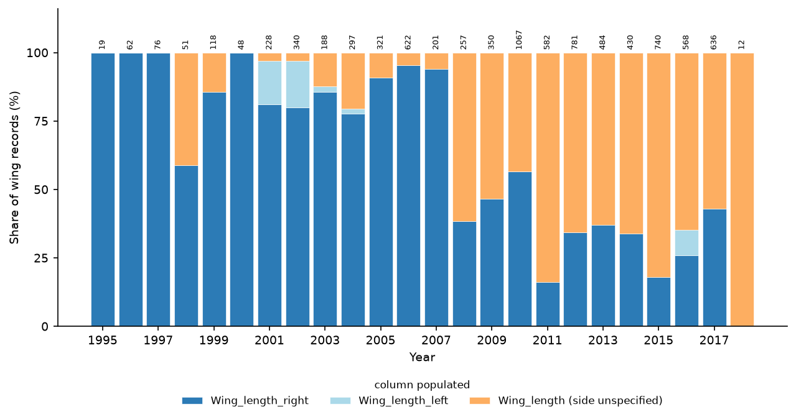

```{r load-estimates, include=FALSE}
desc        <- readRDS("../Analysis/output/descriptive_summary.rds")
cw_phylo    <- readRDS("../Analysis/output/controlled_wing_phylo_results.rds")
mass        <- readRDS("../Analysis/output/mass_results.rds")
multi_phylo <- readRDS("../Analysis/output/multitrait_phylo_results.rds")
biv_phylo   <- readRDS("../Analysis/output/bivariate_phylo_results.rds")
var_phylo   <- readRDS("../Analysis/output/variance_phylo_results.rds")
diet_phylo  <- readRDS("../Analysis/output/diet_interaction_phylo.rds")
clim        <- readRDS("../Analysis/output/climate_trends.rds")
es          <- readRDS("../Analysis/output/effect_scale.rds")
rr          <- readRDS("../Analysis/output/referee_reruns/referee_reruns.rds")

# format a count with a thousands separator for inline use
.n <- function(x) format(x, big.mark = ",", trim = TRUE)
# format a signed estimate / CI bound to 2 dp with a true minus sign
.s <- function(x) sub("-", "−", sprintf("%.2f", x))
# format a signed value to 1 dp with a true minus sign
.s1 <- function(x) sub("-", "−", sprintf("%.1f", x))
# format a signed estimate to 4 dp with a true minus sign
.s4 <- function(x) sub("-", "−", sprintf("%.4f", x))

# pull row from cw_phylo$before_after with optional term filtering
.cw <- function(mod, term = NULL) {
  r <- cw_phylo$before_after[cw_phylo$before_after$model == mod, ]
  if (!is.null(term)) r <- r[r$term == term, ]
  if (nrow(r) == 0) return(list(b = "NA", lo = "NA", hi = "NA", dec = "NA", dec_lo = "NA", dec_hi = "NA", n = "NA"))
  list(
    b      = .s(r$estimate[1]),
    lo     = .s(r$ci_lo[1]),
    hi     = .s(r$ci_hi[1]),
    dec    = .s1(r$mm_per_decade[1]),
    dec_lo = .s1(r$mm_per_decade_lo[1]),
    dec_hi = .s1(r$mm_per_decade_hi[1]),
    n      = .n(r$N[1])
  )
}

cw_m0           <- .cw("M0")
cw_m1a          <- .cw("M1a_src")
cw_m1           <- .cw("M1")
cw_m2           <- .cw("M2")
cw_m3           <- .cw("M3")
cw_m3_cc        <- .cw("M3_cc")
cw_m5src_within <- .cw("M5src", "yr_within_src")
cw_m5src_mean   <- .cw("M5src", "yr_src_mean")
cw_m6           <- .cw("M6")
cw_m7           <- .cw("M7")
cw_noanom       <- .cw("M3_noanom")
cw_long         <- .cw("M3_longrun")
cw_m5site_within <- .cw("M5", "yr_within_site")
cw_m5srccc_within <- .cw("M5src_cc", "yr_within_src")
b_atten_full    <- sprintf("%.0f", 100 * (1 - cw_phylo$before_after$estimate[cw_phylo$before_after$model == "M3"] /
                                          cw_phylo$before_after$estimate[cw_phylo$before_after$model == "M0"]))
# contributors and municipalities in the full sample and in the wing sample
prov <- local({
  e <- new.env(); load("../Analysis/data/derived/passer90.rda", envir = e)
  d <- e$passer90; w <- subset(d, !is.na(conc.wing.length))
  list(n_src = length(unique(d$Main_researcher)), n_site = length(unique(d$Municipality)),
       n_src_w = length(unique(w$Main_researcher)), n_site_w = length(unique(w$Municipality)))
})

# effect scale
if (!is.null(es)) {
  .esw <- es$wing$using_scaling_sd
  wing_pct_dec    <- .esw["est", "pct_per_decade"]
  wing_pct_rec    <- .esw["est", "pct_over_record"]
  wing_pct_rec_lo <- .esw["lo",  "pct_over_record"]
  wing_pct_rec_hi <- .esw["hi",  "pct_over_record"]
} else {
  wing_pct_dec <- -2.58; wing_pct_rec <- -5.9; wing_pct_rec_lo <- -9.0; wing_pct_rec_hi <- -2.8
}

# multi-trait comparisons from multi_phylo
.mt_phylo <- function(trait_name, mod, term = "scaled_yr") {
  df <- multi_phylo$comparison_lme4
  r <- df[df$trait == trait_name & df$model == mod & df$term == term, ]
  if (nrow(r) == 0) return(list(b = "NA", b2 = "NA", lo = "NA", hi = "NA", lo2 = "NA", hi2 = "NA", pct = "NA", pct_lo = "NA", pct_hi = "NA", n = "NA"))
  list(
    b      = .s4(r$phylo_estimate[1]),
    b2     = .s(r$phylo_estimate[1]),
    lo     = .s4(r$phylo_lower[1]),
    hi     = .s4(r$phylo_upper[1]),
    lo2    = .s(r$phylo_lower[1]),
    hi2    = .s(r$phylo_upper[1]),
    pct    = .s1(r$phylo_pct_per_decade[1]),
    pct_lo = .s1(r$phylo_pct_lower[1]),
    pct_hi = .s1(r$phylo_pct_upper[1]),
    n      = .n(r$phylo_n[1])
  )
}

multi_lme4 <- readRDS("../Analysis/output/multitrait_results.rds")
.mt_lme4 <- function(trait_name, mod, term = "scaled_yr") {
  df <- multi_lme4$table
  r <- df[df$trait == trait_name & df$model == mod & df$term == term, ]
  if (nrow(r) == 0) return(list(b = "NA", b2 = "NA", lo = "NA", hi = "NA", lo2 = "NA", hi2 = "NA", pct = "NA", pct_lo = "NA", pct_hi = "NA", n = "NA"))
  list(
    b      = .s4(r$estimate[1]),
    b2     = .s(r$estimate[1]),
    lo     = .s4(r$lower[1]),
    hi     = .s4(r$upper[1]),
    lo2    = .s(r$lower[1]),
    hi2    = .s(r$upper[1]),
    pct    = .s1(r$pct_per_decade[1]),
    pct_lo = .s1(r$pct_per_decade_lower[1]),
    pct_hi = .s1(r$pct_per_decade_upper[1]),
    n      = .n(r$n[1])
  )
}

mass_m0     <- .mt_phylo("ln_body_mass", "M0_baseline")
mass_m1a    <- .mt_lme4("ln_body_mass", "M1a_src")
mass_m1     <- .mt_phylo("ln_body_mass", "M1_src_site")
mass_m3     <- .mt_phylo("ln_body_mass", "M3_ring")
mass_within <- .mt_phylo("ln_body_mass", "MWsrc_mundlak_contributor", "yr_within_src")

bill_m0     <- .mt_phylo("Bill_width.mm.", "M0_baseline")
bill_m1a    <- .mt_lme4("Bill_width.mm.", "M1a_src")
bill_m1     <- .mt_phylo("Bill_width.mm.", "M1_src_site")
bill_m3     <- .mt_phylo("Bill_width.mm.", "M3_ring")
bill_within <- .mt_phylo("Bill_width.mm.", "MWsrc_mundlak_contributor", "yr_within_src")

# variance results
var_s0 <- var_phylo$comparison[var_phylo$comparison$tier == "S0" & var_phylo$comparison$term == "scaled_yr", ]
var_s3 <- var_phylo$comparison[var_phylo$comparison$tier == "S3" & var_phylo$comparison$term == "scaled_yr", ]
var_s7_yr <- var_phylo$comparison[var_phylo$comparison$tier == "S7" & var_phylo$comparison$term == "scaled_yr", ]
var_s7_tm <- var_phylo$comparison[var_phylo$comparison$tier == "S7" & var_phylo$comparison$term == "scaled_tmean", ]

# diet interaction
diet_base <- diet_phylo$interaction_table_all_specs[diet_phylo$interaction_table_all_specs$model == "A" & diet_phylo$interaction_table_all_specs$term == "interaction", ]
diet_ctrl <- diet_phylo$interaction_table_all_specs[diet_phylo$interaction_table_all_specs$model == "A_src_site" & diet_phylo$interaction_table_all_specs$term == "interaction", ]
diet_p90  <- diet_phylo$quantile_slopes_all_specs[diet_phylo$quantile_slopes_all_specs$model == "A_src_site" & diet_phylo$quantile_slopes_all_specs$quantile == "p90", ]

# climate trends (pooled locality random-slope model with a year random effect)
.clim_row <- function(v, dp) { r <- clim$pooled[clim$pooled$variable == v & clim$pooled$weighting == "unweighted + year RE", ]
  f <- function(x) sub("-", "−", sprintf(paste0("%+.", dp, "f"), x))
  list(b = f(r$slope_per_decade), lo = f(r$lower), hi = f(r$upper), est = r$slope_per_decade) }
clim_t <- .clim_row("tmean", 3); clim_w <- .clim_row("tmax_warmq", 2)
clim_p <- .clim_row("prec_annual", 1); clim_s <- .clim_row("spei12_dec", 3)
clim_t_tot <- sprintf("%+.2f", clim_t$est * (2018 - 1995) / 10)
# lnCVR rows (atlantic_variance_sigma.R); the first row of each label is the rma fit
vres <- readRDS("../Analysis/output/variance_results.rds")
.lc <- function(label) { x <- vres$lncvr[vres$lncvr$analysis == label, ][1, ]
  list(b = .s(x$estimate), lo = .s(x$lower), hi = .s(x$upper), k = x$k) }
lc_src5  <- .lc("within species x sex x contributor, n >= 5")
lc_src2  <- .lc("within species x sex x contributor, n >= 2")
lc_src10 <- .lc("within species x sex x contributor, n >= 10")
lc_carr  <- .lc("E.Carrano only, n >= 5")
```

```{r main-text-env, include=FALSE}
# Every estimate defined in the main text (index.qmd), evaluated once into `ms`, so that
# the text moved to Supplementary Note S5 keeps a single source for each number.
ms <- local({
  src <- readLines("index.qmd", warn = FALSE)
  starts <- grep("^```\\{r", src); ends <- grep("^```\\s*$", src)
  e <- new.env(parent = globalenv())
  for (s0 in starts) { s1 <- min(ends[ends > s0]); eval(parse(text = src[(s0 + 1):(s1 - 1)]), envir = e) }
  e
})
```

# Supplementary Notes

## Supplementary Note S1: Macroecological Provenance and Contributor Turnover

Large-scale biodiversity trait compilations aggregate measurements across numerous independent research initiatives spanning wide geographical territories and multiple decades [@rodrigues_atlantic_2019]. In our analytical sample from the ATLANTIC BIRD TRAITS database, `r prov$n_src` contributors (research groups, identified by their principal investigator) carried out field mist-netting in `r prov$n_site` municipalities between 1995 and 2018 (`r prov$n_src_w` contributors and `r prov$n_site_w` municipalities in the wing sample; Fig. S1).

A provenance audit revealed substantial compositional turnover among active research teams over time: only 6 of the `r prov$n_src_w` contributors in the wing sample sampled birds in both the early period (1995–2006; 12 active contributors) and the late period (2013–2018; 33 active contributors; Fig. S1). Furthermore, spatial sampling expanded northward and into higher-elevation montane habitats during the latter half of the time series. In avian morphometrics, differences between observers can be of the same order as the temporal changes of interest [@yezerinac1992measurement], and the column that supplied the analysed wing length also changed over time (Fig. S2). When contributor identity is left uncontrolled, compositional turnover can mimic temporal phenotypic change: the unadjusted wing-length decline (`r with(ms, b_w0$b)` mm/decade) falls to `r with(ms, b_w3$b)` mm/decade once contributor, municipality and the other covariates are modelled (main text; REML ladder in Table S1), although the size of that attenuation is itself uncertain (Table S4), and the apparent trends in bill width and trait variance do not persist.

To resolve genuine biological change from sampling turnover, all models beyond the baseline incorporate random intercepts for contributor and municipality (`(1 | Main_researcher)`, `(1 | Municipality)`). Within-between random effects models [Mundlak REWB, @mundlak1978pooling; @bell2019fixed] do not detect directional change within contributors, but estimate it imprecisely (within-contributor wing slope: `r cw_m5src_within$dec` mm/decade, 95% CI: `r cw_m5src_within$dec_lo` to `r cw_m5src_within$dec_hi`; complete cases: `r cw_m5srccc_within$dec` mm/decade, 95% CI: `r cw_m5srccc_within$dec_lo` to `r cw_m5srccc_within$dec_hi`; REML).




## Supplementary Note S2: Regional Environmental and Climatic Trends (1995–2018)

We extracted monthly climate data from the WorldClim 2.1 historical monthly weather series [CRU-TS 4.09 downscaled to 2.5 arc-min, @harris2020crudata; @fick2017worldclim] at the capture localities. Of the `r clim$n_localities` coordinate localities, `r clim$n_localities_with_data` had raster values; the other `r clim$n_localities - clim$n_localities_with_data` fall outside the land mask. SPEI-12 is the standardised 12-month climatic water balance, precipitation minus potential evapotranspiration [@vicenteserrano2010multiscalar]; we calculated potential evapotranspiration with the Hargreaves–Samani method, took the December value of each year, and used 1990–2018 as the reference period. Trends were estimated from the locality-by-year values with linear mixed models on year, with random intercepts and slopes for locality and a random intercept for year.

Across sampling localities, mean annual temperature increased by `r clim_t$b`°C/decade (95% CI: `r clim_t$lo` to `r clim_t$hi`°C/decade), an average warming of `r clim_t_tot`°C between 1995 and 2018 (Fig. S3, top left). Warmest-quarter maximum temperature rose at a similar rate but less certainly (`r clim_w$b`°C/decade, 95% CI: `r clim_w$lo` to `r clim_w$hi`; top right). Total annual precipitation (`r clim_p$b` mm/decade, 95% CI: `r clim_p$lo` to `r clim_p$hi`) and SPEI-12 (`r clim_s$b` units/decade, 95% CI: `r clim_s$lo` to `r clim_s$hi`; bottom left) showed no clear directional trend. Regional environmental change across our capture sites was therefore characterised mainly by warming, without a clear multi-decadal change in moisture availability.

![**Supplementary Figure S3.** Climate at the `r clim$n_localities_with_data` coordinate localities with WorldClim values (1995–2018): annual mean temperature (top left), warmest-quarter maximum temperature (top right), December SPEI-12 (bottom left), and the distribution of per-locality temperature slopes (bottom right). Thin lines show individual localities, the black line the across-locality mean, and the dashed line the pooled random-slope trend (with a year random effect; 95% CI in the panel subtitles).](images/fig-s-climate-trends.png)

## Supplementary Note S3: Species-Level Phenotypic Variability (lnCVR)

The main text reports among-individual phenotypic variability from continuous heteroscedastic dispersion models. As a complementary species-level summary, we computed log coefficient-of-variation ratios ($\ln\text{CVR}$) with small-sample bias correction [@nakagawa2015metaanalysis] for every species with a standard deviation in both the early (1995–2006) and late (2013–2018) periods (at least two records per period), pooling effect sizes in random-effects meta-analytic models using `metafor` [@viechtbauer2010metafor]. Pooled across contributors, variability appeared to increase for wing length and body mass (wing length $\ln\text{CVR} = +0.177$, 95% CI: 0.031 to 0.323, $k = 54$; body mass $+0.193$, 95% CI: 0.021 to 0.366, $k = 57$; bill width $+0.068$, 95% CI: −0.146 to +0.282, $k = 36$). For wing length, restricted to species × sex cells measured by the same contributor in both periods (at least five records per period; $k = `r lc_src5$k`$ cells), the apparent expansion was no longer evident ($\ln\text{CVR} = `r lc_src5$b`$, 95% CI: `r lc_src5$lo` to `r lc_src5$hi`). This subset is small and compositionally narrow: `r lc_carr$k` of the `r lc_src5$k` cells come from one contributor, and the estimate depends on the threshold (`r lc_src2$b` with at least two records per period, $k = `r lc_src2$k`$; `r lc_src10$b` with at least ten, $k = `r lc_src10$k`$).

![**Supplementary Figure S4.** Interspecific patterns of among-individual phenotypic variability ($\ln\text{CVR}$) between early and late sampling periods. Forest plots display the species-level log coefficient-of-variation ratio ($\ln\text{CVR}$) comparing late (2013–2018) versus early (1995–2006) periods for (A) wing length ($k = 54$ species), (B) body mass ($k = 57$ species), and (C) bill width ($k = 36$ species) across Atlantic Forest passerines. Points and error bars represent species estimates and 95% confidence intervals; vertical lines and shaded bands represent random-effects meta-analytic means ($\ln\text{CVR} = +0.177$ for wing length; $+0.193$ for body mass; $+0.068$ for bill width).](images/fig-variability.png)

## Supplementary Note S4: Temperature-Anomaly Models Across Specifications

The main text reports no clear association between morphology and the local annual temperature anomaly ($\Delta T_{\text{local}}$) under the full M3 adjustment set. Because an anomaly measured over a warming study period is itself correlated with calendar year, and because all birds captured at one locality in one year share an anomaly value, we fitted five specifications (Table S3). All are produced by `Analysis/scripts/referee_reruns.R` and stored in `Analysis/output/referee_reruns/referee_reruns.rds`.


In the parsimonious models containing both terms (E1a), calendar year rather than the anomaly carries the signal for wing length and the isometry contrast; at full M3 adjustment (E3b), neither term is clearly associated with any trait. In the parsimonious fits the detrended anomaly (E1b) is associated with the isometry contrast ($p = 0.041$), in line with the consistently positive but uncertain sign reported in the main text. The locality-year intercept, included only in E2a, widens the anomaly standard errors by about 1.3 to 1.5 times relative to E1a, so the other rows may be somewhat over-precise. We did not use a cluster-robust variance estimator: the random-effects structure is non-nested, which available implementations (`clubSandwich` CR2) do not support, so locality-year clustering is handled with a random intercept instead.

A further caveat is one of exposure window rather than statistics. Wing length is fixed at moult, so the mean temperature of the calendar year in which a bird happened to be captured is not a plausible causal exposure for its wing length. Any thermal mechanism would have to operate during feather growth, which these data cannot resolve.

## Supplementary Note S5: Model Specification, Sampling and Convergence

### Robustness and sensitivity models

- **Fully adjusted, complete cases** (M3_cc): the fully adjusted specification on complete cases ($n = `r with(ms, cw_m3_cc$n)`$). The primary sample ($n = `r with(ms, cw_m3$n)`$) does not discard records with incomplete covariates; instead, missingness is encoded explicitly. Records lacking a recorded altitude take a value imputed from other records at the same coordinates, and season and moult carry an explicit `unrecorded` level rather than being dropped. The complete-case model removes the `r with(ms, cw_ss$altitude_na_wing + cw_ss$season_na_wing)` records with an imputed altitude or an unrecorded season, so the contrast between the two isolates the effect of that encoding. Unrecorded moult is kept as an explicit level in both models: it applies to `r with(ms, molt_unrec_pct)`% of wing records, and `r with(ms, molt_src_none)` of the `r with(ms, src_cov$n_src)` contributors never recorded it, so dropping these records would remove whole contributors and confound the complete-case contrast with contributor composition.
- **Fully adjusted, first captures only** (M7): restricted to first captures ($n = `r with(ms, cw_m7$n)`$) to exclude any potential bias from recapture histories.
- **Fully adjusted, anomalous blocks removed** (M3_noanom): re-fitted by REML after excluding `r with(ms, n_anom_blocks)` anomalous sampling blocks (`r with(ms, n_anom_rec)` records). Blocks are contributor $\times$ municipality $\times$ year cells. For each record we took the deviation of its wing length from its own species $\times$ sex mean, averaged those deviations within each cell, and flagged cells with at least 10 records whose mean deviation exceeded 6 mm in absolute value. We set the 6 mm threshold after inspecting the data, so this screen is a post hoc sensitivity check and not part of the primary analysis; the threshold is roughly 1.5 residual standard deviations of the fully adjusted fit and about 8% of a typical wing; a shift of that size shared across an entire contributor-site-year block is more consistent with a protocol or data-entry change than with phenotypic variation. The screen is sign-blind: of the flagged blocks, `r with(ms, sum(cw_ss$anomalous_blocks$mean_dev < 0))` lie below and `r with(ms, sum(cw_ss$anomalous_blocks$mean_dev > 0))` above species means.
- **Year within vs between municipalities** (M5; REML): the same decomposition as M5src with municipality in place of contributor, to separate change within sampled sites from differences between sites sampled at different times.

### Likelihood, priors and sampling

All models were Gaussian linear mixed models fitted in a Bayesian framework with a purpose-written Stan program [@carpenter2017stan]. For the fully adjusted wing model, the length $y_i$ of record $i$ is
$$y_i = \mathbf{x}_i^\top \boldsymbol{\beta} + a_{s[i]} + b_{s[i]}\, t_i + c_{k[i]} + m_{j[i]} + u_{r[i]} + \varepsilon_i, \qquad \varepsilon_i \sim \mathcal{N}(0, \sigma^2),$$
where $\mathbf{x}_i$ holds the fixed effects (sex, standardised year $t_i$, latitude, longitude, elevation, season, moult and wing side), $a_s$ and $b_s$ are the intercept and year-slope deviations of species $s$, and $c_k$, $m_j$ and $u_r$ are normally distributed random intercepts for contributor $k$, municipality $j$ and individual bird $r$, each with its own standard deviation. The other models differ only in the terms they include. The species intercepts have a phylogenetic and a non-phylogenetic component,
$$\mathbf{a} = \sigma_a \left( \sqrt{H^2}\, \mathbf{L} \mathbf{z}_{\text{phy}} + \sqrt{1 - H^2}\, \mathbf{z}_{\text{sp}} \right), \qquad \mathbf{L}\mathbf{L}^\top = A,$$
with $\mathbf{z}_{\text{phy}}, \mathbf{z}_{\text{sp}}$ standard normal and $\mathbf{L}$ the spectral square root of $A$, so that $\mathbf{a}$ has covariance $\sigma_a^2 [H^2 A + (1 - H^2) I]$ and $H^2$ is the phylogenetic share of among-species variance in the intercepts. Species year slopes $b_s$ are modelled as independent among species rather than as a Brownian process. The individual intercepts are integrated out of the likelihood analytically: the records of one bird are jointly normal with covariance $\sigma^2 I + \tau^2 \mathbf{1}\mathbf{1}^\top$, whose inverse and determinant have closed forms, so the thousands of individual effects are never sampled. Together with sampling the phylogenetic effects in the eigenbasis of $A$ (adapting marginalised spectral code by S. Ortega), this makes fitting across many trees feasible.

The response was centred and scaled before fitting and all estimates were back-transformed to the original scale. Priors were weakly informative on that standardised scale: $\mathcal{N}(0, 5)$ for fixed effects, half-Student-$t(3, 0, 1)$ for all standard deviations, $\text{Beta}(1, 1)$ for $H^2$, and $\mathcal{N}(0, 1)$ for the coefficients of the residual-SD model (below). Each model was sampled separately on each tree with CmdStan 2.39.0 through `cmdstanr` 0.9.0: four chains of 1,000 warm-up and 500 sampling iterations (2,000 warm-up and 2,000 sampling iterations for bill width), with `adapt_delta` = 0.95 and a maximum tree depth of 12. The posteriors from the 20 trees were combined by pooling their draws, which gives the mixture posterior over trees and so carries phylogenetic uncertainty into every estimate [@nakagawa2019rubin]. No sampler divergences occurred in any of the `r with(ms, bz$n_fits)` models fitted. For the parameters quoted in the text (year, temperature-anomaly and interaction terms, and the phylogenetic share and correlation of the species slopes), the largest rank-normalised $\hat{R}$ on any single tree was `r with(ms, bz$foc_rhat)` (`r with(ms, if (rhat_top$n_gt_101 == 0) "none" else rhat_top$n_gt_101)` of the `r with(ms, .n(rhat_top$n_terms))` parameter-by-tree combinations exceeded 1.01). Trees on which any of these parameters initially exceeded 1.01 were refitted with 2,000 warm-up and 2,000 sampling iterations per chain and thinned by four, so that each keeps the same weight in the tree mixture; the replaced fits and the list of refitted trees are archived. The smallest per-tree bulk and tail effective sample sizes were `r with(ms, rhat_top$ess_bulk_min)` and `r with(ms, rhat_top$ess_tail_min)`, and summed over the `r with(ms, bz$n_trees)` trees they were at least `r with(ms, bz$foc_ess)` and `r with(ms, bz$foc_ess_tail)`, respectively [@vehtari2021rhat]. The among-species standard deviation of the intercepts mixed more slowly (largest per-tree $\hat{R}$ `r with(ms, bz$sd_rhat)`; smallest per-tree bulk effective sample size `r with(ms, bz$sd_ess)`); it is a nuisance parameter here and none of our conclusions rests on it.

### Agreement with REML and phylogenetic slopes

As an independent check on the estimation engine, every model except the detrended-anomaly and locality-year checks (see *Interannual temperature anomalies*) was also fitted by restricted maximum likelihood with the `propto` covariance structure of `glmmTMB` v1.1.14 [@williams2025glmmtmb] and pooled across 50 trees with Rubin's rules [@nakagawa2019rubin; @nakagawa2026prepr4pcm]. For the temporal coefficients reported here, posterior means and REML estimates differed by at most `r with(ms, bz$shift_max)` posterior standard deviations, and posterior SDs were 1.00–`r with(ms, bz$sd_ratio_max)` times the REML standard errors, as expected when the uncertainty in the variance components is propagated. The complete REML control ladder is given in Supplementary Tables S1 and S2. As a sensitivity analysis, we refitted the fully adjusted wing model and the isometry model with Brownian species slopes correlated with the species intercepts, a structure that `propto` cannot represent. For the fully adjusted wing model we also compared, by REML likelihood ratio on each tree, the model with independent species slopes against one that adds a phylogenetic slope component (boundary-corrected $p$). The larger model failed to converge on `r with(ms, lrt_w$n_fail)` of the 50 trees; on the remaining `r with(ms, lrt_w$n)`, `r with(ms, if (lrt_w$sig == 0) "none" else lrt_w$sig)` gave $p < 0.05$ (median $p = `r with(ms, lrt_w$p_med)`$).

# Supplementary Tables

```{r tab-s-wing, echo=FALSE}
#| tbl-colwidths: [54, 13, 12, 14, 7]   # widths set in Word, 2026-10-06
.row <- function(label, x) data.frame(Model = label, Beta = x$b, CI = paste0("[", x$lo, ", ", x$hi, "]"),
                                      Rate = x$dec, N = x$n)
tbl_cw_data <- rbind(
  .row("M0: Baseline (sex + latitude + phylogeny)", cw_m0),
  .row("M1a: + Contributor intercept only", cw_m1a),
  .row("M1: + Contributor and municipality intercepts", cw_m1),
  .row("M2: M1 + Wing-column proxy + Longitude + Altitude", cw_m2),
  .row("M3: Full controls (M2 + Season + Moult + Individual)", cw_m3),
  .row(paste0("M3_cc: Full controls on complete cases (N = ", cw_m3_cc$n, ")"), cw_m3_cc),
  .row("M3_noanom: Full controls without the anomalous sampling blocks", cw_noanom),
  .row("M5src: Within-contributor temporal slope (Mundlak REWB)", cw_m5src_within),
  .row("M5: Within-municipality temporal slope (Mundlak REWB)", cw_m5site_within),
  .row("M4: Separate trend per contributor (mean slope)", .cw("M4")),
  .row("M3_longrun: Six long-running contributors only", cw_long),
  .row("M6: Unknown-sex replication (full M3 controls)", cw_m6),
  .row("M7: First captures only (no recaptures)", cw_m7))
knitr::kable(tbl_cw_data, row.names = FALSE,
             col.names = c("Model specification", "β (mm/SD-yr)", "95% CI", "Rate (mm/dec)", "N"),
             caption = "**Supplementary Table S1.** REML phylogenetic mixed models of wing length (glmmTMB, pooled across 50 trees; Wald 95% CI), evaluating temporal trajectories across sequential control tiers. M1a is shown to separate the contributor term from the municipality term, which M1 adds together.")
```

```{r tab-s-mass, echo=FALSE}
#| tbl-colwidths: [55, 12, 14, 12, 7]   # widths set in Word, 2026-10-06
.mrow <- function(label, x) data.frame(Specification = label, Beta = x$b, CI_95 = paste0("[", x$lo, ", ", x$hi, "]"),
                                       Rate_pct_dec = paste0(x$pct, "%"), N = x$n)
tbl_mass_data <- rbind(
  .mrow("Body mass M0 Baseline (sex + latitude + phylogeny)", mass_m0),
  .mrow("Body mass M1 (+ Contributor and municipality intercepts)", mass_m1),
  .mrow("Body mass M3 Full controls (M1 + Longitude + Altitude + Season + Individual)", mass_m3),
  .mrow("Body mass Mundlak within-contributor slope", mass_within))
knitr::kable(tbl_mass_data, row.names = FALSE,
             col.names = c("Model specification", "β (per SD-yr)", "95% CI", "Rate (%/dec)", "N"),
             caption = "**Supplementary Table S2.** Body mass temporal models across control tiers (REML check on the Bayesian estimates, glmmTMB pooled across 50 phylogenetic trees). Moult is not included because it is not recorded for enough of the body-mass records; M3 and the within-contributor model use the complete-case sample.")
```

```{r tab-s-thermal, echo=FALSE}
#| tbl-colwidths: [19, 19, 19, 10, 13, 7, 6, 7]   # widths set in Word, 2026-10-06
.lab_m <- c(E1a_anomaly_plus_year = "E1a: anomaly + year", E1b_detrended_anomaly = "E1b: detrended anomaly",
            E2a_locyear_random_intercept = "E2a: + locality-year intercept",
            E3_M3_adjusted_phylo = "E3: M3 adjustment", E3b_M3_adjusted_phylo_plus_year = "E3b: M3 adjustment + year")
.lab_r <- c("wing length (mm)" = "Wing length (mm)", "log body mass" = "log body mass",
            "isometry contrast lnM-3lnL" = "Isometry contrast (ln M − 3 ln L)")
.lab_t <- c(dT = "ΔT (local annual anomaly, °C)", dT_detr = "ΔT detrended (°C)", scaled_yr = "Year (per SD)")
.pick <- function(x, trees) { x <- x[x$response %in% names(.lab_r) & x$term %in% names(.lab_t), ]
  data.frame(model = x$model, response = x$response, term = x$term, estimate = x$estimate, se = x$se, p = x$p, n = x$n,
             trees = if (is.null(trees)) x$trees_used else trees) }
th <- rbind(.pick(rr$E1, 1), .pick(rr$E2, 1), .pick(rr$E3, NULL))
th <- data.frame(Specification = .lab_m[th$model], Response = .lab_r[th$response], Term = .lab_t[th$term],
                 Estimate = signif(th$estimate, 3),
                 CI = sprintf("[%s, %s]", signif(th$estimate - 1.96 * th$se, 3), signif(th$estimate + 1.96 * th$se, 3)),
                 p = signif(th$p, 2), N = .n(th$n), Trees = th$trees)
knitr::kable(th, row.names = FALSE, col.names = c("Specification", "Response", "Term", "Estimate", "95% CI", "p", "N", "Trees"),
             caption = "**Supplementary Table S3.** Temperature-anomaly associations across specifications (REML, glmmTMB). The anomaly effect is per °C and the year effect per SD of year; the isometry contrast is ln M − 3 ln L. E1a, E1b and E2a are fits without phylogeny, with contributor and municipality intercepts (a simpler control set than M3); E2a adds a locality-year intercept. E3 and E3b use the full M3 adjustment set across 50 phylogenetic trees; `Trees` is the number of trees whose fits converged and were pooled (E3 converged on fewer than 50 trees for body mass and the isometry contrast, whereas every E3b fit used all 50).")
```

```{r tab-s-recovery, echo=FALSE}
#| tbl-colwidths: [18, 15, 8, 12, 6, 7, 16, 18]   # widths set in Word, 2026-10-06
rs <- readRDS("../Analysis/output/referee_reruns/recovery_sim.rds")
.scen <- c(clean = "Clean", real = "Real conditional modes", artefact = "Calibrated artefact")
rt <- rs$summary
rt <- rt[order(match(rt$scenario, names(.scen)), -rt$planted, match(rt$model, c("M0", "M1", "M3", "M5src"))), ]
rt <- data.frame(Scenario = .scen[rt$scenario], Planted = sprintf("%.1f", rt$planted), Model = rt$model,
                 Mean = sprintf("%.2f", rt$mean_est), Bias = sprintf("%.2f", rt$bias), RMSE = sprintf("%.2f", rt$rmse),
                 Coverage = sprintf("%.2f", rt$coverage), Excl0 = sprintf("%.2f", rt$excl_zero))
knitr::kable(rt, row.names = FALSE,
             col.names = c("Scenario", "Planted (mm/dec)", "Model", "Mean estimate", "Bias", "RMSE", "Coverage of 95% CI", "Share of CIs excluding 0"),
             caption = sprintf("**Supplementary Table S4.** Recovery of planted wing-length trends in the real sampling structure (%d simulated data sets per scenario and planted value; lme4 REML). Clean: contributor and municipality effects drawn independently of year. Real: their conditional modes from the model fitted to the real data. Calibrated artefact: independent draws plus a contributor shift proportional to the contributor's mean capture year, sized to reproduce the real gap between the baseline and fully adjusted estimates. M5src gives the within-contributor slope. Estimates in mm/decade. A cluster bootstrap over contributors (%d draws) gave a 95%% interval of %.2f to %.2f mm/decade for the difference between the M3 and M0 slopes.",
                               rs$reps, rs$attenuation$n_boot, rs$attenuation$diff_ci95[1], rs$attenuation$diff_ci95[2]))
```

```{r tab-s-logwing, echo=FALSE}
#| tbl-colwidths: [48, 16, 6, 14, 10, 6]   # widths set in Word, 2026-10-06
lw <- readRDS("../Analysis/output/referee_reruns/logwing.rds")
.lwm <- c(M0 = "M0: Baseline", M1 = "M1: + Contributor and municipality", M3 = "M3: Full controls",
          M5src = "M5src: Within-contributor slope", M3_noanom = "M3_noanom: Full controls without anomalous blocks")
lt <- lw$summary
lt <- data.frame(Model = .lwm[lt$model], Response = ifelse(lt$response == "log", "log wing length", "wing length (mm)"),
                 Rate = sprintf("%.2f", lt$per_decade), CI = sprintf("[%.2f, %.2f]", lt$lo, lt$hi),
                 Unit = lt$unit, Trees = lt$m_used)
knitr::kable(lt, row.names = FALSE, col.names = c("Model", "Response", "Rate", "95% CI", "Unit", "Trees"),
             caption = "**Supplementary Table S5.** Wing-length ladder with millimetre and log-scale responses (glmmTMB REML with the phylogenetic species intercept, Rubin-pooled over the trees with a positive-definite Hessian; Wald 95% CI). Log-scale slopes are expressed as % per decade.")
```

```{r tab-s-anombase, echo=FALSE}
#| tbl-colwidths: [27, 12, 33, 7, 15, 6]   # widths set in Word, 2026-10-06
ab <- readRDS("../Analysis/output/referee_reruns/anomaly_baseline.rds")
.abr <- c("wing length (mm)" = "Wing length (mm)", "log body mass" = "log body mass", "isometry contrast lnM-3lnL" = "Isometry contrast (ln M − 3 ln L)")
.abt <- c(dT = "ΔT, baseline over the locality's records", dT_full = "ΔT, baseline over 1995–2018", scaled_yr = "Year (per SD)")
at <- ab$fits
at <- data.frame(Response = .abr[at$response], Model = at$model, Term = .abt[at$term],
                 Estimate = signif(at$estimate, 3), CI = sprintf("[%s, %s]", signif(at$lower, 3), signif(at$upper, 3)),
                 Trees = at$trees_used)
knitr::kable(at, row.names = FALSE, col.names = c("Response", "Model", "Term", "Estimate", "95% CI", "Trees"),
             caption = sprintf("**Supplementary Table S6.** Temperature-anomaly models under two baselines (full M3 adjustment, glmmTMB REML, phylogenetic species intercept, Rubin-pooled; n = %s). The primary anomaly subtracts the locality's mean over its own records (correlation with capture year %.2f); the alternative subtracts the locality's unweighted mean over every year from 1995 to 2018 (correlation %.2f), so it retains the regional warming trend and is shown with and without calendar year.",
                               format(ab$n, big.mark = ","), ab$baselines$cor_year[1], ab$baselines$cor_year[2]))
```

# References {.unnumbered}

::: {#refs}
:::
